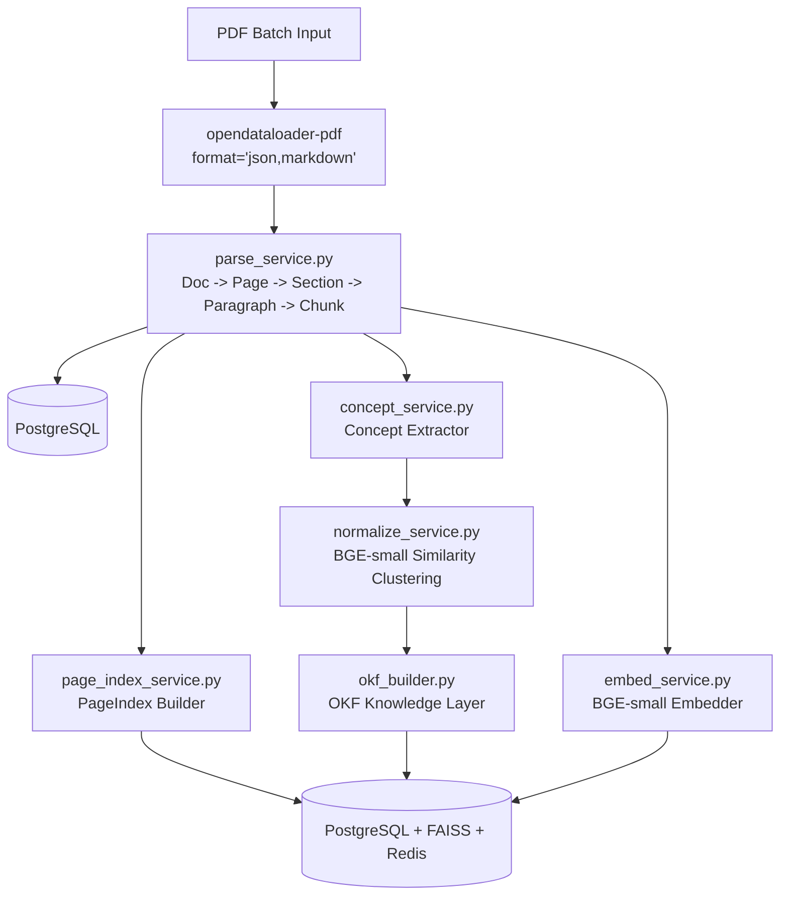
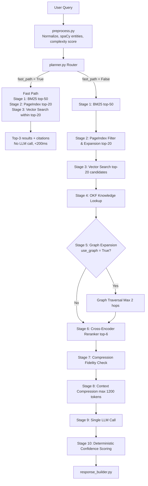

# ARCHITECTURE.md — KRE Technical Architecture

## Hard Constraints (violation = blocked PR)
- Maximum ONE LLM call per query, end to end.
- Fast path (BGE-only): p95 < 200ms.
- Full pipeline: p95 < 3000ms.
- Every module logs `latency_ms` and `confidence_score`.
- LLM receives only compressed context. Never raw chunks.
- Max tokens to LLM: 1200.
- Graph traversal: `MAX_HOPS = 2`, `MAX_NODES = 40` (hardcoded, not config).
- Graph activated ONLY when query planner detects relationship intent.
- Cheapest retrieval stage always runs before expensive ones.

---

## Staged Retrieval Principle

**Wrong:**
```text
Query → [BM25 ∥ Vector ∥ Graph ∥ PageIndex] → Merge → Rerank → LLM
```

**Right:**
```text
Query → BM25 → PageIndex → Vector → OKF → Graph? → Rerank → LLM
```

Each stage reduces the search space for the next stage.
You never run a GPU-model search across the full corpus.
Graph only activates when the planner flags relationship intent.

---

## Ingestion Pipeline (Offline, Batch)



---

## PageIndex — Precise Definition

A PageIndex is NOT a page-level BM25 index.  
A BM25 inverted index maps: `term → [(doc_id, frequency, positions)]`  
A PageIndex maps:
```text
term → [(doc_id, page_num, section_heading, section_depth,
         element_type, structural_weight, chunk_id)]
```

The difference is `structural_weight`, computed as:

```text
structural_weight = base_tf_idf
  * element_type_multiplier[element_type]
  * section_depth_decay(section_depth)
  * heading_anchor_bonus(is_in_heading)
```

```text
element_type_multiplier:
  heading:   2.5
  table:     2.0
  paragraph: 1.0
  caption:   1.2
  list_item: 1.1
  footnote:  0.6

section_depth_decay(depth):
  depth 1 (top-level section):  1.0
  depth 2 (subsection):         0.85
  depth 3+:                     0.70

heading_anchor_bonus:
  If query term appears in section heading for this page: +0.5
```

This means a keyword in a section heading scores 3x higher than
the same keyword in a footnote. BM25 cannot express this. That is
what makes PageIndex a distinct retrieval primitive.

PageIndex also stores:
- `section_start_page`, `section_end_page` (for locality expansion)
- `cross_reference_targets`: pages where this section is cited/referenced
- `element_sequence_position`: position of element within page (for proximity scoring between co-occurring terms)

---

## OKF — Ontology-driven Knowledge Framework

The Knowledge Graph is ONE VIEW over OKF. OKF is the knowledge itself.

OKF stores:

```yaml
Concept:
  concept_id: str
  name: str
  canonical_name: str
  aliases: list[str]
  concept_type: Enum
  source_chunk_ids: list[str]
  confidence: float
  low_confidence: bool

concept_type enum:
  [PRODUCT, PERSON, ORGANIZATION, METRIC, POLICY, PROCESS, DATE_PERIOD, LOCATION, ISSUE, REGULATION, TERM]
```

```yaml
Property:
  concept_id: str
  property_name: str
  property_value: str
  value_type: str
  source_chunk_id: str
  confidence: float

  Example:
    concept: "Battery Model X"
    type: PRODUCT
    properties:
      failure_rate: "12%", source: DOC001-P4-S2
      failure_mode: "overheating", source: DOC001-P5-S3
      affected_period: "Q2 2024", source: DOC001-P5-S1
```

```yaml
Relation:
  from_concept_id: str
  relation_type: Enum
  to_concept_id: str
  relation_weight: float
  source_chunk_id: str

relation_type enum:
  [CAUSES, AFFECTS, DEPENDS_ON, PART_OF, REPORTS_TO, MENTIONS, VIOLATES, DEFINES, SUPERSEDES, CONTRADICTS]
```

Graph view (derived, not primary):
- **Nodes** = Concepts
- **Edges** = Relations

This distinction matters for query time:

```text
"What caused battery overheating?"
  Graph answer: Battery →[CAUSES]→ Overheating  (an edge)
  OKF answer:   Battery.failure_mode = "overheating" (a property)
                Battery.failure_rate = "12%" (a property)
                Battery →[CAUSES]→ Returns (a relation chain)
```

OKF supports: *"What is the failure rate of the product with the highest return rate in Q2?"*  
Graph alone cannot express that query — it has no typed properties.

```python
# Graph (adjacency list, dict-based):
# NOT NetworkX in production.
# Implementation: Dict[concept_id, List[Relation]]
# Persisted to PostgreSQL relations table.
# Loaded at startup into memory as adjacency dict.
# Max nodes: 5000 per corpus.
# Max edges: 50000 per corpus.
# Above these limits: partition by document cluster.
```

---

## Query Pipeline (Online, Per Query)



---

## Module Map

```text
kre/
├── ingestion/
│   ├── parse_service.py          # opendataloader-pdf wrapper
│   ├── page_index_service.py     # PageIndex builder (structural)
│   ├── concept_service.py        # Entity/concept extractor (spaCy)
│   ├── normalize_service.py      # BGE-small entity deduplication
│   ├── okf_builder.py            # OKF Knowledge Layer builder
│   └── embed_service.py          # BGE-small FAISS indexer
├── retrieval/
│   ├── planner.py                # Deterministic retrieval router
│   ├── bm25_retriever.py         # rank-bm25, stage 1
│   ├── page_index_retriever.py   # Structural scoring, stage 2
│   ├── vector_retriever.py       # FAISS BGE-small, stage 3
│   ├── okf_retriever.py          # OKF property lookup, stage 4
│   ├── graph_retriever.py        # Adjacency dict traversal, stage 5
│   ├── reranker.py               # bge-reranker-base, stage 6
│   ├── fidelity_check.py         # Entity coverage check, stage 7
│   └── compressor.py             # Context compression, stage 8
├── llm/
│   └── llm_service.py            # Single LLM call, structured output
├── api/
│   └── main.py                   # FastAPI endpoints
├── graph/
│   └── langgraph_pipeline.py     # LangGraph stage orchestration
└── db/
    ├── postgres.py
    ├── faiss_store.py
    └── redis_cache.py
```
