# KRE Architecture Bible — Canonical Connected System (Refactor-ready v3)
## Version: 2026-10-06 — v3

> **Purpose:** This document is the single architecture source of truth for rebuilding KRE.
> It reconciles the earlier diagrams instead of replacing their concepts.
>
> This revision resolves conflicting interfaces and execution paths. Sections 7/49, 12, 17, 18/51/52, 47 and 54 define the implementation contracts; all diagrams are projections of those contracts. Refactor-ready means a design baseline, not a claim of production validation.

---

## Validation scope

This revision was checked for section continuity, JSON syntax and identity fields, Mermaid syntax, and the architecture contradictions identified in the review. It is not an implementation test or an empirical claim about retrieval quality, latency or hallucination rates.

## Correction Log — 2026-10-06

This revision fixes the architecture review findings:

1. **Baseline and enrichment publication are separated.**
   Baseline retrieval can become READY without OKF/graph enrichment.

2. **Structured execution is separated from discovery ranking.**
   RRF/reranking cannot drop verified calculations, operands, or mandatory selections.

3. **Adaptive reranking is deferred until calibrated.**
   Deterministic exact lookups may skip reranking; narrative retrieval follows a fixed bounded policy.

4. **All model work is budgeted before invocation.**
   Generation, encoder reranking/verification, embeddings and LAYA have separate call limits under one global cost/token/deadline ledger. Mandatory final validation capacity is reserved first.

5. **Verification has mechanical and semantic layers.**
   Answer support and request completeness are measured separately.

6. **Interfaces were corrected.**
   Workspace/version identity is carried through contracts; evidence locators can be unresolved; execution records are typed mandatory evidence.

7. **Dry runs now require bindings and distinguish correlation from causation.**

8. **Large-corpus operational controls are explicit.**
   Limits, batching, backpressure, pagination, checkpoints, retries, partitioning, deadlines, cancellation and no-progress termination are part of the architecture.

9. **Checklist items are requirements until tests prove them.**

10. **V3 aligns every workflow and contract.**
    Workspace/source/snapshot identity, per-requirement routing, branch joins, supported partial answers and explicit incomplete-search exits are consistent.

11. **V3 makes lifecycle publication concurrency-safe.**
    Baseline activation and optional enrichment use generation-checked atomic publication; stale jobs cannot overwrite newer sources or resurrect deletions.

12. **V3 specifies the CSV/Excel execution tool.**
    Registered file references and a restricted operation/formula AST drive pandas/approved backends over complete selections. Full provenance is persisted; compact execution references enter model context.

# 0. Canonical Architecture — Connected Overview

Baseline is independently queryable. Optional enrichment can only extend a compatible active baseline through the publication rules in section 47. Query details are split into sections 19, 21, 26 and 54.

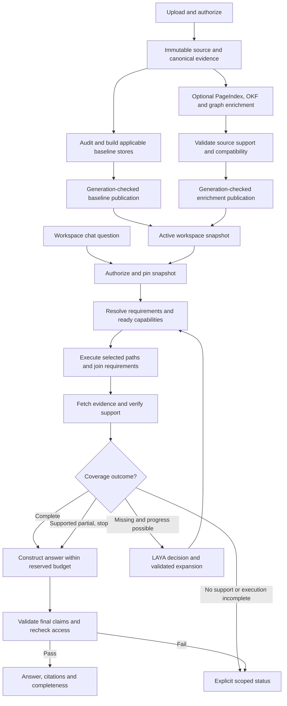
```mermaid
flowchart TB
    U["Upload and authorize"] --> C["Immutable source and canonical evidence"]
    C --> B["Audit and build applicable baseline stores"]
    B --> P["Generation-checked baseline publication"]
    C --> E["Optional PageIndex, OKF and graph enrichment"]
    E --> V["Validate source support and compatibility"]
    V --> EP["Generation-checked enrichment publication"]
    P --> S["Active workspace snapshot"]
    EP --> S
    Q["Workspace chat question"] --> A["Authorize and pin snapshot"]
    S --> A
    A --> R["Resolve requirements and ready capabilities"]
    R --> X["Execute selected paths and join requirements"]
    X --> K["Fetch evidence and verify support"]
    K --> D{"Coverage outcome?"}
    D -->|Complete| AN["Construct answer within reserved budget"]
    D -->|Missing and progress possible| L["LAYA decision and validated expansion"]
    L --> R
    D -->|Supported partial, stop| AN
    D -->|No support or execution incomplete| N["Explicit scoped status"]
    AN --> F["Validate final claims and recheck access"]
    F -->|Pass| O["Answer, citations and completeness"]
    F -->|Fail| N
```

Ingestion creates source-backed representations. Indexes and summaries guide discovery; exact source evidence and verified execution records support answers. Missing enrichment never implies missing source evidence. A failed search never proves that the answer is absent.

# 1. How the Earlier Diagrams Map to This Architecture

The diagrams you showed are retained conceptually:

| Earlier diagram concept | Canonical role |
|---|---|
| Upload / register / validate | Ingestion |
| Source capability detection | Capability discovery |
| Document / table / JSON / code / web / OCR pipelines | Source adapters |
| Canonical typed dataset / canonical prose evidence | Canonical evidence |
| Evidence quality + coverage audit | Pre-publication QA |
| Available source capabilities | Capability manifest |
| Asset / visual evidence store | Visual evidence store |
| Graph / relationship store | Relationship store |
| OKF / fact store | OKF store |
| Dataset / schema store | Structured store |
| Structural index / PageIndex | Structural store |
| Dense vector index | Dense store |
| Lexical / BM25 | Lexical store |
| Build Knowledge Map | Navigation / routing layer |
| Evidence locations + retrieval capabilities | Knowledge Map metadata |
| Versioned capability snapshot | Query-time contract |
| Knowledge / relationship coordinator | Knowledge Map router |
| Evidence location + capability routing | Capability router |
| Retrieval coordinator | Retrieval execution layer |
| Structured execution | Deterministic data execution |
| Evidence fusion / RRF | Candidate fusion |
| Deterministic / neural reranker | Ranking |
| Evidence + claim verification | Hallucination control |
| LAYA | Bounded retrieval expansion |
| Replacement / deletion / recovery | Lifecycle control |

**Important:** PageIndex is a retrieval/structural signal. It is **not required to gate vector retrieval**. Independent retrieval branches may run in parallel when the router selects them.

---

# 2. Architecture Planes

Each plane has explicit ownership. The retrieval plane does not own source truth, publication or answer generation.

| Plane | Owns | Produces |
|---|---|---|
| Ingestion | Immutable source registration, parsing, block classification and extraction QA | Versioned canonical evidence and detected capability profile |
| Knowledge | Baseline/enrichment artifacts, locators, registry and atomic publication | Compatible immutable capability snapshot and navigation map |
| Execution | Authorized structured operations and selected discovery paths | Mandatory execution evidence and ranked discovery candidates |
| Answer | Requirement joins, source fetch, support checks and answer assembly | Validated complete/partial answer or scoped failure status |

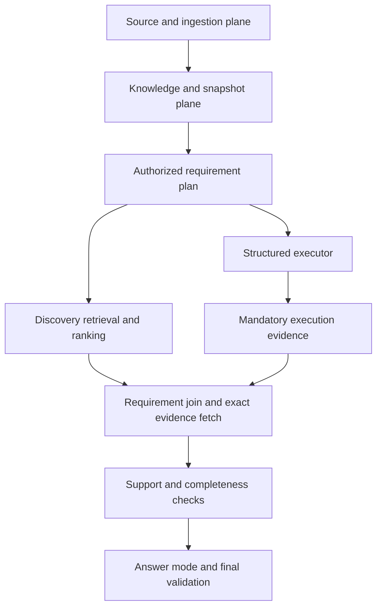
```mermaid
flowchart TB
    I["Source and ingestion plane"] --> K["Knowledge and snapshot plane"]
    K --> P["Authorized requirement plan"]
    P --> S["Structured executor"]
    P --> D["Discovery retrieval and ranking"]
    S --> E["Mandatory execution evidence"]
    D --> J["Requirement join and exact evidence fetch"]
    E --> J
    J --> V["Support and completeness checks"]
    V --> A["Answer mode and final validation"]
```

Section 54 defines partial, no-support, incomplete, clarification and validation-failure exits. The last node is not permission to deliver unchecked synthesis.

# 3. Data Ownership — What Is the Source of Truth?

The system must distinguish **source truth**, **source-backed representation**, **routing metadata**, and **generated language**.

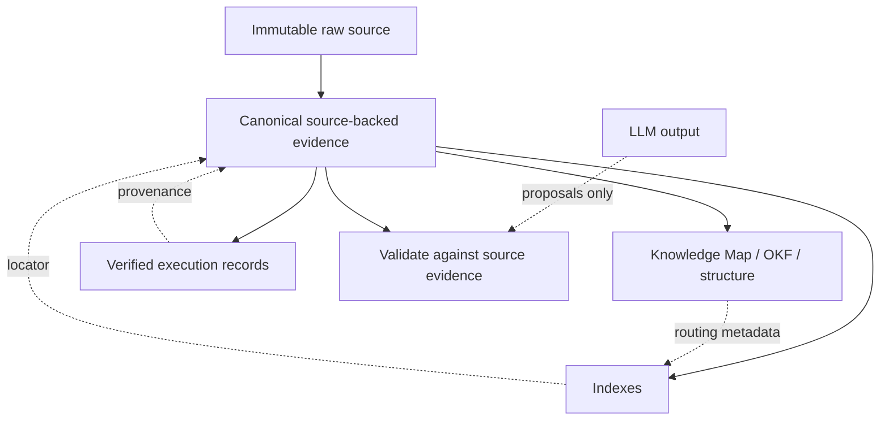
```mermaid
flowchart TB
    RAW["Immutable raw source"]
    CAN["Canonical source-backed evidence"]
    KM["Knowledge Map / OKF / structure"]
    IDX["Indexes"]
    EXEC["Verified execution records"]
    LLM["LLM output"]

    RAW --> CAN
    CAN --> KM
    CAN --> IDX
    CAN --> EXEC

    KM -. routing metadata .-> IDX
    IDX -. locator .-> CAN
    EXEC -. provenance .-> CAN

    LLM -. proposals only .-> PROPOSE["Validate against source evidence"]
    CAN --> PROPOSE
```

### Authority model

```text
1. Immutable source
2. Canonical source-backed representation
3. Verified structured execution result
4. Knowledge Map / OKF / structural representation
5. Retrieval indexes
6. Cache
7. LLM-generated language
```

Important correction:

> Ingestion does **not** create truth. It creates source-backed representations of a source that may itself be incomplete, malformed, stale, misleading, or wrong.

The system therefore records provenance and extraction quality rather than assuming extraction is truth.

### Knowledge Map rule

The Knowledge Map answers:

```text
WHAT exists?
WHERE is it?
WHICH version?
WHICH capability can reach it?
WHAT coverage / readiness does that capability have?
```

It does not replace canonical evidence.

# 4. Upload + Registration

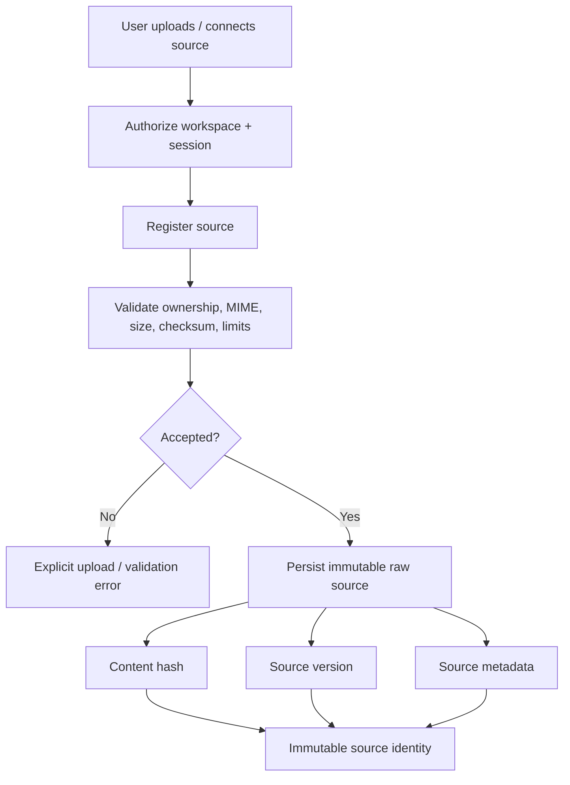
```mermaid
flowchart TD
    U["User uploads / connects source"]
    U --> AUTH["Authorize workspace + session"]
    AUTH --> REG["Register source"]
    REG --> VALID["Validate ownership, MIME, size, checksum, limits"]
    VALID --> D{"Accepted?"}

    D -->|No| ERR["Explicit upload / validation error"]
    D -->|Yes| RAW["Persist immutable raw source"]

    RAW --> HASH["Content hash"]
    RAW --> VER["Source version"]
    RAW --> META["Source metadata"]

    HASH --> ID["Immutable source identity"]
    VER --> ID
    META --> ID
```

### Required identity

```text
workspace_id
source_id
source_version
content_hash
created_at
source_type
ownership
access_policy
```

Never use a mutable filename as the primary identity.

---

# 5. Source Capability Detection

Detect capabilities during extraction at block/sheet/asset level; do not assign one architecture solely from file extension or a guessed document label.

| Observable evidence | Detected capability | Processing consequence |
|---|---|---|
| Readable prose and reliable page/slide/paragraph locators | Text | Lexical baseline and meaningful prose chunks for compatible embeddings |
| Valid headings, sections or slide order | Structure | Basic locators now; richer PageIndex optional |
| Accepted rows/cells, headers, types and table boundaries | Structured data | Complete dataset/schema store and executor if safe |
| Images, diagrams, scanned pages or charts | Visual/OCR | Bounded extraction and quality audit; record exclusions |
| Supported entity mentions and relation candidates | Potential relationships | Optional rules/LLM proposals with source-backed validation |

```json
{
  "workspace_id": "ws_1",
  "source_id": "src_123",
  "source_version": 7,
  "profile_kind": "DETECTED_NOT_READINESS",
  "blocks": [
    {"block_id": "b1", "type": "prose", "locator": {"page": 1}},
    {"block_id": "b2", "type": "table", "locator": {"page": 2}}
  ],
  "capabilities": {"text": true, "tables": true, "structure": true}
}
```

Detected capabilities become usable only through the QA, readiness and coverage contracts in sections 9/12. User preferences influence desired enrichment, not whether extracted data is valid.

# 6. Upload and Preprocessing Adapter Matrix

All adapters emit canonical evidence with workspace/source/version identity and exact locators. A mixed file can use several adapters without duplicating the same source identity.

| Input | Extract and validate | Locator |
|---|---|---|
| PDF, DOCX, books, policies, papers | Prose, headings, tables, figures; detect scanned regions and reading-order errors | Page/paragraph/section, table/cell, asset bounding box |
| PPTX | Slide titles, body text, notes, tables, images and slide order | Slide/shape/note/table/cell |
| CSV, XLSX, Parquet | Complete accepted records, sheet/range/schema, value/formula policies | Sheet/row/column and immutable dataset record ID |
| JSON/records/API | Objects, nested field paths, types and pagination completeness | Object/record/field path plus captured response version |
| Code/repository | Files, symbols, optional AST/dependency records | Commit/file/span/symbol |
| HTML/web | Captured immutable content, headings, DOM/link structure | Capture/version/element/span |
| Images/scanned pages | OCR and optional bounded visual interpretation with quality limits | Asset/page/bounding box |

Baseline prose chunking follows accepted paragraph/heading/page boundaries with bounded token size and overlap only where needed. Preserve source offsets, section identity and referenced table/figure/footnote links. Avoid embedding raw large tables row by row by default: index schema/header/navigation text and route calculations to the structured dataset. Vector coverage records exactly which prose blocks were indexed; excluded blocks remain visible in metadata and lexical/source access when valid.

Embed bounded batches during ingestion and deduplicate by content plus pipeline/model identity. Query embedding is only for the question or bounded query variants. TITAN/BGE embeddings provide similarity, not reliable typed relationship extraction. No whole-PDF LLM prompt is required: optional relation proposals use bounded source windows and validated identities/qualifiers.

# 7. Canonical Evidence Model

Every adapter must eventually emit a common evidence model.

Canonical records retain identity, location, typed content, unit/qualifiers, provenance, extraction quality and support status. Section 49 uses the same schema for a prose variant; `content` is the typed value or text. Execution operand/result records use `value` within their own typed interface.


## Minimal interface

```json
{
  "workspace_id": "ws_1",
  "evidence_id": "ev_abc",
  "source_id": "src_123",
  "source_version": 7,
  "type": "table_cell",
  "location": {
    "page": 73,
    "table_id": "table_17",
    "row_id": "Europe",
    "column_id": "2024"
  },
  "content": 184.2,
  "unit": "USD_million",
  "qualifiers": {"region": "Europe", "year": 2024},
  "provenance": {
    "content_hash": "sha256:...",
    "extraction_pipeline_version": "parse-v5"
  },
  "quality": {"status": "VALID", "confidence": 0.98},
  "support_status": "ASSERTED"
}
```

---

# 8. Evidence Status Model

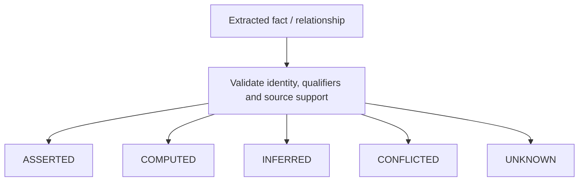
```mermaid
flowchart TD
    E["Extracted fact / relationship"] --> CHECK["Validate identity, qualifiers and source support"]

    CHECK --> ASSERTED["ASSERTED"]
    CHECK --> COMPUTED["COMPUTED"]
    CHECK --> INFERRED["INFERRED"]
    CHECK --> CONFLICTED["CONFLICTED"]
    CHECK --> UNKNOWN["UNKNOWN"]
```

## Meaning

| Status | Meaning | Can directly support factual answer? |
|---|---|---|
| ASSERTED | Explicitly present in source | Yes |
| COMPUTED | Deterministically calculated from supported evidence | Yes |
| INFERRED | Hypothesis/derived relationship not explicitly established | No standalone factual proof; may guide discovery or be a labeled hypothesis with supported premises |
| CONFLICTED | Sources disagree | Must expose conflict |
| UNKNOWN | Insufficient support | No |

---

# 9. Evidence Quality and Coverage Audit

Baseline QA runs before publication; enrichment has independent QA. Each applicable baseline capability needs explicit accepted coverage and exclusions. A partly extracted source may be queryable only for declared usable scope; it is not suitable for a full-file aggregate/summary unless the required coverage is complete.

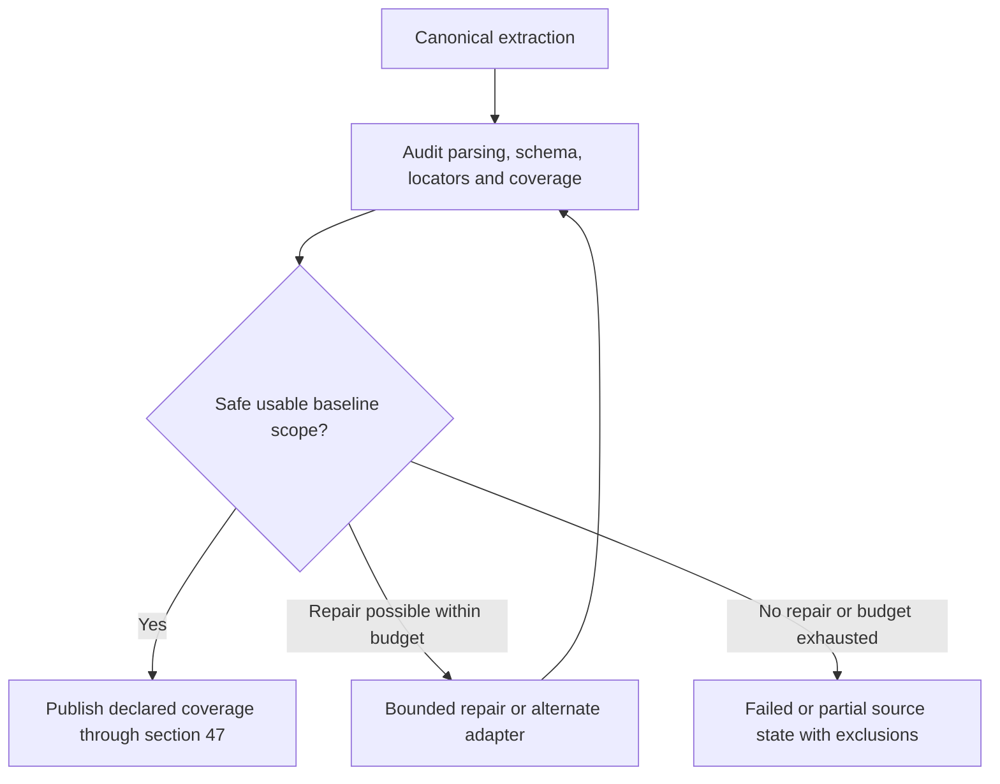
```mermaid
flowchart TD
    E["Canonical extraction"] --> Q["Audit parsing, schema, locators and coverage"]
    Q --> D{"Safe usable baseline scope?"}
    D -->|Yes| B["Publish declared coverage through section 47"]
    D -->|Repair possible within budget| R["Bounded repair or alternate adapter"]
    R --> Q
    D -->|No repair or budget exhausted| F["Failed or partial source state with exclusions"]
```

Check parsing completeness, rejected pages/rows, reading order, type/schema validity, location integrity, source hashes and extraction quality. An optional enrichment failure keeps the valid baseline active. If dense indexing fails after bounded retries, publish only a verified lexical/source fallback with dense unavailable; do not label an incomplete dense index ready. If parsing fails, raw bytes are not valid evidence: raw-text fallback requires successfully extracted, locatable authorized text.

Three total attempts apply only to retry-safe transient operations. Schema errors, corrupt input, unsupported formats and access denial do not receive blind retries. Every repair/retry consumes the job's global bounds and stops on no progress.

# 10. Capability Manifest vs Capability Snapshot

These are different artifacts and are published in two stages.

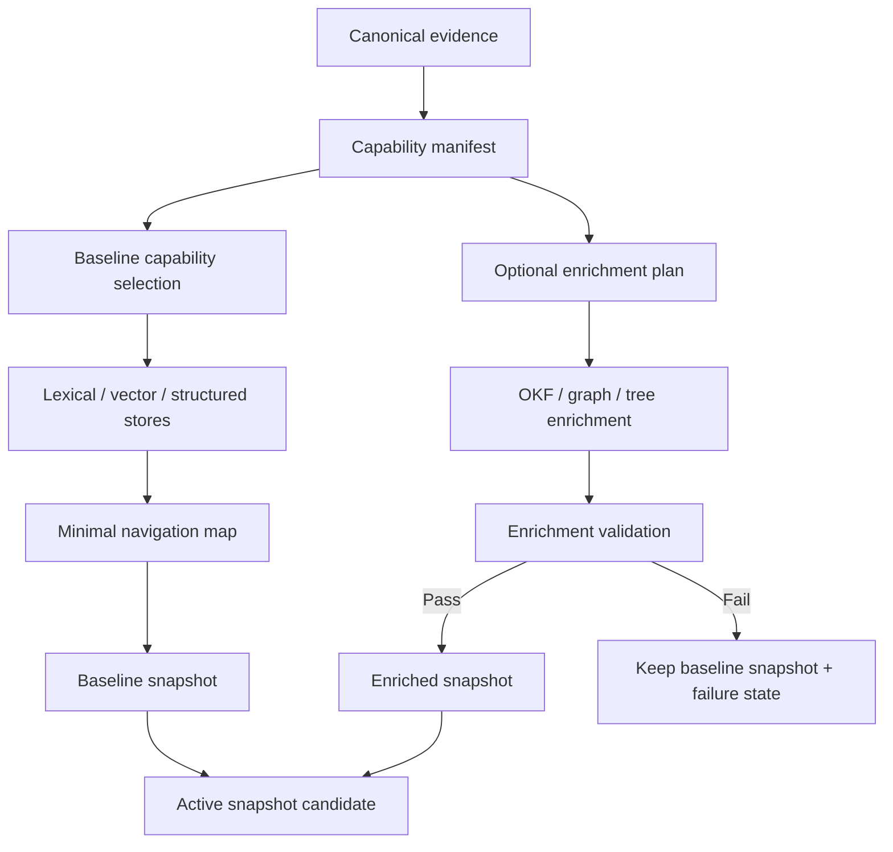
```mermaid
flowchart TB
    CAN["Canonical evidence"] --> MAN["Capability manifest"]

    MAN --> BASE["Baseline capability selection"]
    BASE --> BIDX["Lexical / vector / structured stores"]
    BIDX --> BMAP["Minimal navigation map"]
    BMAP --> BSNAP["Baseline snapshot"]

    MAN --> ENR["Optional enrichment plan"]
    ENR --> OKF["OKF / graph / tree enrichment"]
    OKF --> EQ["Enrichment validation"]
    EQ -->|Pass| ESNAP["Enriched snapshot"]
    EQ -->|Fail| BKEEP["Keep baseline snapshot + failure state"]

    BSNAP --> ACTIVE["Active snapshot candidate"]
    ESNAP --> ACTIVE
```

### Capability manifest

Describes what the source **supports or partially supports**, including readiness and limitations.

```json
{
  "workspace_id": "ws_1",
  "source_id": "src_123",
  "source_version": 7,
  "capabilities": {
    "text": {
      "available": true,
      "coverage": "pages_1_84",
      "ready": true,
      "exclusions": []
    },
    "semantic_search": {
      "available": true,
      "coverage": "chunks_1_620",
      "ready": true,
      "pipeline_version": "embed-v4"
    },
    "structured_execution": {
      "available": true,
      "coverage": "sheet:Sales",
      "ready": true,
      "schema_version": "schema-v3"
    },
    "graph": {
      "available": false,
      "coverage": null,
      "ready": false,
      "failure_state": "ENRICHMENT_PENDING"
    }
  }
}
```

Required metadata includes:

```text
workspace_id
source_id
source_version
capability name
availability
readiness
coverage
exclusions
pipeline/model version
schema/index version
failure state
last successful build
```

### Snapshot

A snapshot freezes the exact versions used by query execution:

```text
source versions
baseline/enrichment generation
index versions
schema versions
Knowledge Map version
capability policy version
authorization policy version
```

A baseline snapshot may be active before enrichment finishes.

# 11. Materializing Retrieval Infrastructure

Materialization is split into **baseline** and **optional enrichment**.

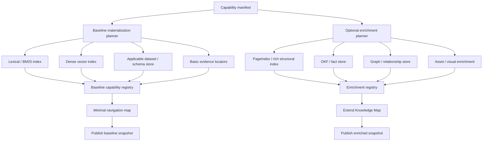
```mermaid
flowchart TD
    MAN["Capability manifest"] --> BP["Baseline materialization planner"]

    BP --> BM["Lexical / BM25 index"]
    BP --> DV["Dense vector index"]
    BP --> DS["Applicable dataset / schema store"]
    BP --> LOC["Basic evidence locators"]

    BM --> BREG["Baseline capability registry"]
    DV --> BREG
    DS --> BREG
    LOC --> BREG

    BREG --> BMAP["Minimal navigation map"]
    BMAP --> BSNAP["Publish baseline snapshot"]

    MAN --> EP["Optional enrichment planner"]
    EP --> PI["PageIndex / rich structural index"]
    EP --> OF["OKF / fact store"]
    EP --> GR["Graph / relationship store"]
    EP --> AS["Asset / visual enrichment"]

    PI --> EREG["Enrichment registry"]
    OF --> EREG
    GR --> EREG
    AS --> EREG

    EREG --> EMAP["Extend Knowledge Map"]
    EMAP --> ESNAP["Publish enriched snapshot"]
```

### Baseline must be independently usable

A document does **not** wait for:

```text
graph extraction
relationship proposals
LLM summaries
deep PageIndex enrichment
```

if baseline capabilities are already valid.

### Minimal navigation map

The baseline map can be built from deterministic metadata:

```text
source identity
document/page/section locations
schema
table/sheet names
field paths
chunk IDs
index partitions
capability coverage
```

This gives the planner enough information to route ordinary queries without requiring the full graph.

# 12. Retrieval Capability Registry

The registry is resolved inside a pinned workspace snapshot. Detection describes possible capabilities; this registry describes usable operations. `available` alone is never permission to dispatch. Every selected operation must be ready, authorized, version-compatible and have relevant coverage.

```json
{
  "workspace_id": "ws_1",
  "snapshot_id": "snap_42",
  "source_id": "doc_1",
  "source_version": 7,
  "baseline_generation": 7,
  "enrichment_generation": null,
  "operations": {
    "text_search": {
      "available": true,
      "ready": true,
      "backend": "bm25",
      "artifact_version": "bm25-v7",
      "coverage": "pages_1_84",
      "exclusions": [],
      "failure_state": null
    },
    "aggregate": {
      "available": true,
      "ready": true,
      "backend": "pandas",
      "artifact_version": "dataset-v7",
      "schema_version": "schema-v3",
      "coverage": "sheet:Sales",
      "exclusions": [],
      "allowed_operations": ["sum", "count", "min", "max", "mean", "group_by"],
      "failure_state": null
    },
    "relationship_traversal": {
      "available": false,
      "ready": false,
      "backend": "graph",
      "artifact_version": null,
      "coverage": null,
      "exclusions": [],
      "failure_state": "ENRICHMENT_PENDING"
    }
  }
}
```

Other operations use the same readiness/version/coverage fields. Dense artifacts additionally identify embedding model, dimensions, normalization and metric; incompatible models use separate indexes. Unready graph/PageIndex routes immediately use compatible baseline evidence discovery rather than repeatedly trying pending enrichment. Coverage is explicit ranges/partitions in production, not an informal string.

# 13. OKF Enrichment

OKF is an **optional enrichment layer**. It improves routing and relationship reasoning; it is not a prerequisite for baseline search.

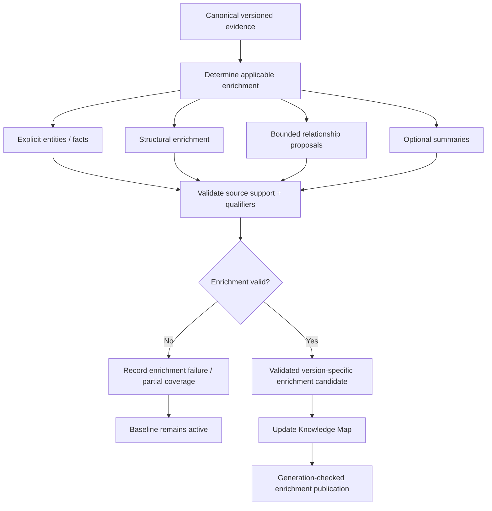
```mermaid
flowchart TB
    CAN["Canonical versioned evidence"] --> DET["Determine applicable enrichment"]

    DET --> ENT["Explicit entities / facts"]
    DET --> STR["Structural enrichment"]
    DET --> REL["Bounded relationship proposals"]
    DET --> SUM["Optional summaries"]

    ENT --> VAL["Validate source support + qualifiers"]
    STR --> VAL
    REL --> VAL
    SUM --> VAL

    VAL --> STATUS{"Enrichment valid?"}
    STATUS -->|No| FAIL["Record enrichment failure / partial coverage"]
    STATUS -->|Yes| PUB["Validated version-specific enrichment candidate"]

    FAIL --> KEEP["Baseline remains active"]
    PUB --> KM["Update Knowledge Map"]
    KM --> SNAP["Generation-checked enrichment publication"]
```

LLM-derived relationships and summaries are proposals/derived representations, never authoritative facts.

Every derived relationship must retain:

```text
source evidence IDs
source locations
source version
relationship type
derivation method
confidence / quality
support status
model/pipeline version if applicable
```

**No OKF content means “unknown relationship,” not “no source evidence.”**

# 14. Knowledge Map — Stored Metadata

The map is routing/navigation metadata, not answer proof.

| Metadata | Purpose |
|---|---|
| Workspace, source identity/version and snapshot binding | Resolve authorized compatible evidence |
| Pages/slides/sections, tables/sheets/fields and locators | Target source fetch and typed execution |
| Concepts, metrics, entity identities and qualified relationships | Suggest candidate routes; fetch supporting source evidence |
| Capability readiness, artifact versions and coverage/exclusions | Avoid unavailable paths and expose incomplete scope |
| Short source/section descriptions | Positive discovery hints, never hard negative proof |

Represent known-ready, known-partial, enrichment-pending, enrichment-failed and unknown separately. “Not mapped” does not mean “not in the source.” Baseline deterministic metadata is sufficient for ordinary routing; deep graph/LLM summaries are optional.

# 15. Knowledge Map Example

Question:

> What was Europe revenue in 2024?

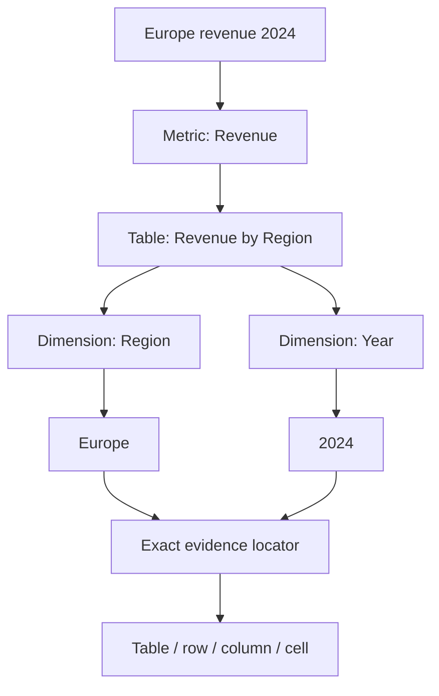
```mermaid
flowchart TB
    Q["Europe revenue 2024"] --> M["Metric: Revenue"]
    M --> T["Table: Revenue by Region"]
    T --> D["Dimension: Region"]
    D --> EU["Europe"]
    T --> Y["Dimension: Year"]
    Y --> Y24["2024"]

    EU --> LOC["Exact evidence locator"]
    Y24 --> LOC

    LOC --> CELL["Table / row / column / cell"]
```

The planner can therefore avoid corpus-wide semantic search.

---

# 16. Query Intake

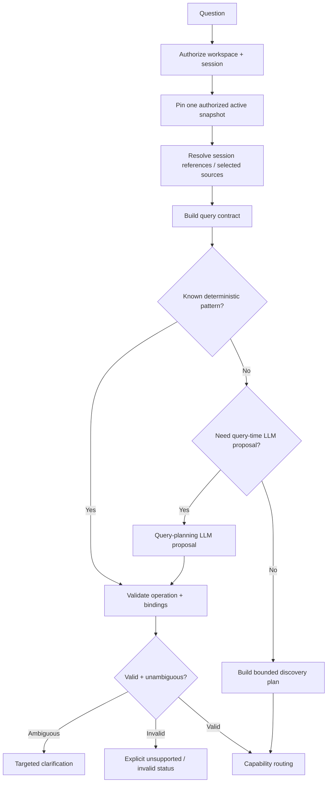
```mermaid
flowchart TD
    Q["Question"] --> AUTH["Authorize workspace + session"]
    AUTH --> PIN["Pin one authorized active snapshot"]
    PIN --> REF["Resolve session references / selected sources"]
    REF --> CONTRACT["Build query contract"]

    CONTRACT --> DET{"Known deterministic pattern?"}
    DET -->|Yes| VALID["Validate operation + bindings"]
    DET -->|No| PROP{"Need query-time LLM proposal?"}

    PROP -->|No| DISC["Build bounded discovery plan"]
    PROP -->|Yes| LLM["Query-planning LLM proposal"]
    LLM --> VALID

    VALID --> AMB{"Valid + unambiguous?"}
    AMB -->|Ambiguous| CLAR["Targeted clarification"]
    AMB -->|Invalid| FAIL["Explicit unsupported / invalid status"]
    AMB -->|Valid| ROUTE["Capability routing"]

    DISC --> ROUTE
```

The planner must distinguish:

```text
intent = aggregate
operation = sum / mean / group_by / compare / trend
```

An `aggregate` intent with `operation = lookup` is invalid unless the contract explicitly defines lookup as a pre-aggregation selection step.

# 17. Query Model and Resource Budgets

All operations share one query ledger, but unlike operations have distinct counters. A generation call is a text-generating model invocation, including an LLM used as a verifier or reranker. An encoder reranker does not consume a generation-call slot, but consumes its own slot, cost and latency. LAYA is a decision model and does not generate the answer.

| Counter | Default policy for the initial implementation |
|---|---|
| `MAX_QUERY_LLM_CALLS` | 2 generation calls across planning, retrieval reasoning, synthesis and generative verification |
| `MAX_QUERY_RERANK_CALLS` | 2 total bounded encoder batches: at most one for initial narrative retrieval and one for the single allowed expansion |
| `MAX_QUERY_ENCODER_VERIFY_CALLS` | 1 bounded support-check batch, only if such a component is configured and evaluated |
| `MAX_QUERY_EMBED_CALLS` | 2 bounded query-embedding batches; no document embedding during Q&A |
| `MAX_QUERY_LAYA_CALLS` | 2 decision calls across initial optional routing and escalation |
| `MAX_EXPANSION_STEPS` | 1 targeted expansion; initial retrieval is not an expansion |
| `MAX_TOOL_ATTEMPTS` | 3 total attempts per retry-safe transient operation, also charged to global tool/cost/deadline limits |

These defaults are policy values to benchmark, not measured optimal values. Policy must also set numeric total cost, total tool calls, query tokens, context tokens, candidates, rows scanned, graph depth/fanout, deadline and output limits before deployment. Counters count attempted invocations, including failed ones; provider retries are visible and consume budgets.

Before dispatch, atomically reserve call slots, token/cost estimates and deadline capacity. Optional work cannot consume mandatory finishing reservations. Settle actual usage afterwards; never run parallel branches against the same unreserved remaining budget.

Default free-form answer path: deterministic contract binding, bounded encoder reranking, source-support checks, **one synthesis call plus one final semantic-verification call**. The verifier checks the actual final wording, citations, qualifiers, causal claims and contradictions. A configured encoder verifier may replace a generative verifier only after evaluation for that use. Mechanical checks remain mandatory.

| Path | Generation calls | Result |
|---|---|---|
| Fully bound exact lookup/calculation | 0 | Mechanically checked deterministic template and citations |
| Planning proposal plus exact calculation | 1 | Code validates arguments; deterministic answer |
| Free-form synthesis plus final generative verifier | 2 | Deliver only supported validated wording |
| Optional LLM planning plus synthesis plus generative verifier | 3 | Disallowed under default; clarify/use an approved template or explicitly configure a higher policy |

Generated summaries/answers cannot skip final semantic validation because pre-synthesis evidence was checked. If validation fails, remove unsupported claims and revalidate deterministically where possible; do not exceed the budget to repair prose. Otherwise return verified excerpts/results with an explicit partial status, clarification, or insufficiency. No blanket two-call promise applies to all question types.

Ingestion/enrichment has a separate bounded ledger. A vendor's zero generated tokens does not imply zero decision-model cost. The global ledger records all model/tool invocations, input/output tokens, billable usage, retries and elapsed time.

# 18. Query Contract

The query contract is the interface between language understanding and deterministic execution.

```json
{
  "query_id": "q_123",
  "workspace_id": "ws_1",
  "snapshot_id": "snap_7",
  "intent": "aggregate",
  "operation": "sum",
  "target": {
    "dataset": "sales",
    "metric": "revenue",
    "dimensions": {
      "region": "Europe",
      "year": 2024
    }
  },
  "required_evidence": [
    {
      "requirement_id": "r1",
      "kind": "structured_records",
      "locator": null,
      "selection": {
        "region": "Europe",
        "year": 2024
      }
    }
  ],
  "answer_mode": "deterministic",
  "budget_policy_id": "query-default-v3",
  "max_query_llm_calls": 2
}
```

### Contract rules

```text
intent != operation
operation must be legal for the selected capability
locators may be null before discovery
selection predicates may be specified before evidence IDs exist
snapshot_id is mandatory
workspace_id is mandatory
requirement_id is stable and mandatory for every required evidence item
query-time records carry workspace_id, query_id and snapshot_id
canonical records are source-versioned and do not belong to one query snapshot
```

The planner may say **what it needs** without pretending that the evidence has already been discovered.

# 19. Per-Requirement Capability Routing

Split mixed questions into stable requirement IDs before choosing routes. Bind entity, metric, period, units, selected sources and filters; clarify material ambiguity rather than guessing. LAYA may propose initial routing or expansion; code owns permission, readiness, compatibility and budget validation.

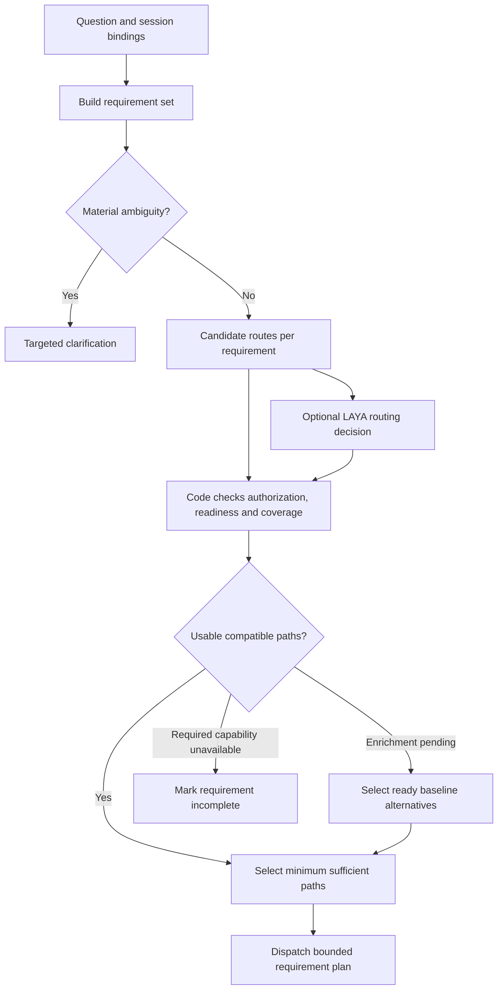
```mermaid
flowchart TB
    Q["Question and session bindings"] --> R["Build requirement set"]
    R --> A{"Material ambiguity?"}
    A -->|Yes| C["Targeted clarification"]
    A -->|No| P["Candidate routes per requirement"]
    P --> L["Optional LAYA routing decision"]
    P --> G["Code checks authorization, readiness and coverage"]
    L --> G
    G --> D{"Usable compatible paths?"}
    D -->|Yes| S["Select minimum sufficient paths"]
    D -->|Enrichment pending| B["Select ready baseline alternatives"]
    D -->|Required capability unavailable| I["Mark requirement incomplete"]
    B --> S
    S --> E["Dispatch bounded requirement plan"]
```

| Requirement | Preferred ready path | Compatible fallback |
|---|---|---|
| Exact value, filter, calculation | Complete structured dataset + approved executor | Exact source-backed cells/records only if completeness and bindings can be verified |
| Prose in a known section | Structural locator + source fetch | BM25/dense with section/source filters |
| Semantic prose | BM25 + compatible dense | Lexical/raw canonical text if dense unavailable |
| Relationship or explanation | Supported graph locators + source fetch + relevant prose | Baseline prose retrieval; inferred links guide discovery only |
| Visual requirement | Accepted asset/OCR/visual evidence | Text only if it supports that same requirement; otherwise incomplete |
| Exhaustive list or whole-document summary | Coverage-aware paginated workflow | Explicit scoped/partial output, never top-k presented as exhaustive |

Multiple rows may apply to one question. A known section must not suppress a required table calculation or visual branch. Routing confidence is not answer confidence. Document descriptions are positive routing hints, not sufficient evidence for early rejection. `NO_SUPPORT` requires a completed bounded scoped search; failed/unavailable branches produce incomplete status.

# 20. Retrieval Coordinator

The Retrieval Coordinator executes **discovery retrieval**. Structured execution is a separate execution plane.

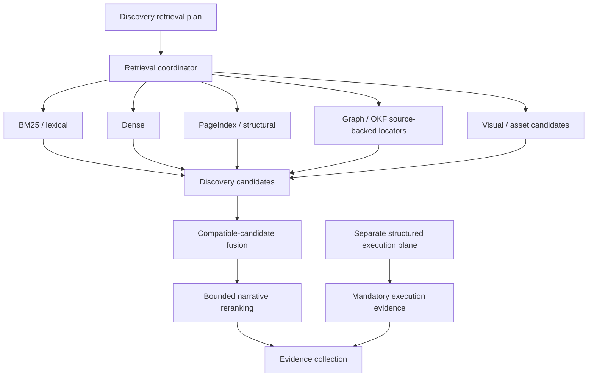
```mermaid
flowchart TB
    PLAN["Discovery retrieval plan"] --> RC["Retrieval coordinator"]

    RC --> B["BM25 / lexical"]
    RC --> D["Dense"]
    RC --> P["PageIndex / structural"]
    RC --> G["Graph / OKF source-backed locators"]
    RC --> V["Visual / asset candidates"]

    B --> C["Discovery candidates"]
    D --> C
    P --> C
    G --> C
    V --> C

    C --> FUSE["Compatible-candidate fusion"]
    FUSE --> RANK["Bounded narrative reranking"]
    RANK --> EV["Evidence collection"]

    S["Separate structured execution plane"] --> EXE["Mandatory execution evidence"]
    EXE --> EV
```

A verified structured result is **never dropped because its retrieval rank is low**.

# 21. Concurrent Retrieval and Requirement Join

Dispatch only selected independent branches. Graph discovery followed by source fetch is dependent and stays sequential. Structured results remain outside RRF and enter the requirement join as mandatory evidence.

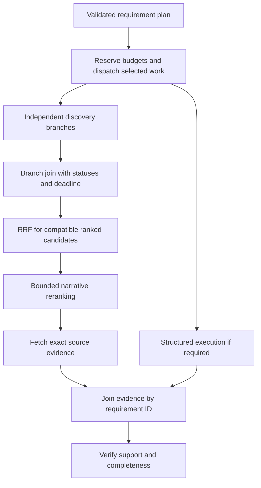
```mermaid
flowchart TB
    P["Validated requirement plan"] --> D["Reserve budgets and dispatch selected work"]
    D --> R["Independent discovery branches"]
    D --> S["Structured execution if required"]
    R --> J["Branch join with statuses and deadline"]
    J --> F["RRF for compatible ranked candidates"]
    F --> K["Bounded narrative reranking"]
    K --> E["Fetch exact source evidence"]
    E --> Q["Join evidence by requirement ID"]
    S --> Q
    Q --> V["Verify support and completeness"]
```

Each branch reports `COMPLETE`, `FAILED`, `TIMED_OUT`, `CANCELLED` or `UNAVAILABLE`, its scope/coverage and artifact versions. Join when all selected branches terminate, at the global deadline, or after a justified early stop where every requirement is already supported and mandatory exhaustive/conflict checks are complete. Fusion cannot begin merely because the first branch returned.

A timed-out required branch remains incomplete unless another branch independently satisfies the same requirement. Retrieval score does not close a requirement. Exhaustive/negative/summary questions need coverage completion; a top result is not an early-stop proof. Log the stop reason and cancellation. Reserve one bounded reranker batch per narrative round, with at most two total under the default single-expansion policy. An expansion that cannot reserve its required reranking/verification budget stops or returns a supported partial result; it does not skip ranking silently.

# 22. BM25

For corpus documents/chunks:

```text
score_BM25(q,d)
```

A standard form:

\[
BM25(q,d)=
\sum_{t\in q}
IDF(t)
\frac{f(t,d)(k_1+1)}
{f(t,d)+k_1(1-b+b\frac{|d|}{avgdl})}
\]

Typical interpretation:

- lexical exactness
- identifiers
- names
- numbers
- rare terms

BM25 is particularly useful for:

```text
"Acme Corp"
"Q4 2024"
"ISO 27001"
"error code E102"
```

---

# 23. Dense Retrieval

For normalized query embedding \(q\) and document embedding \(d\):

\[
sim(q,d)=
\frac{q\cdot d}{\|q\|\|d\|}
\]

Top-k candidates:

\[
C_{dense}=TopK(sim(q,d))
\]

Dense retrieval is useful for:

```text
semantic similarity
paraphrases
concept matching
natural language descriptions
```

---

# 24. PageIndex / Structural Retrieval

PageIndex provides structural navigation.

A document hierarchy retains sections, subsections, paragraphs, tables and appendices with stable parent/child locators. Slide decks retain slide/shape/note relationships instead of inventing page hierarchy.

A structural locator may be:

```json
{
  "workspace_id": "ws_1",
  "source_id": "doc_1",
  "source_version": 7,
  "section_id": "sec_7",
  "page_start": 72,
  "page_end": 75
}
```

It answers:

> Where should I look?

It does not replace the canonical evidence.

---

# 25. Graph / OKF Retrieval

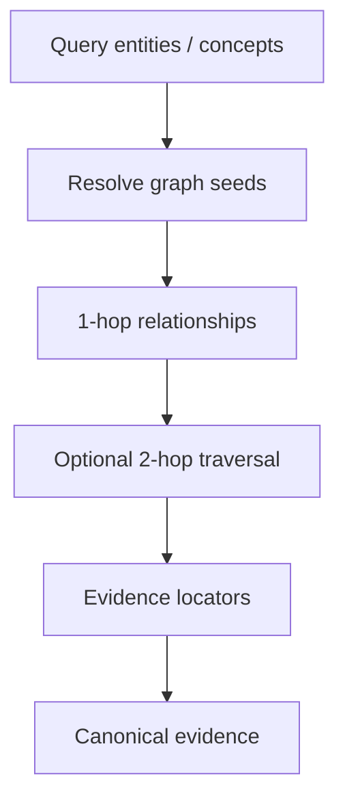
```mermaid
flowchart TB
    Q["Query entities / concepts"] --> SEED["Resolve graph seeds"]
    SEED --> H1["1-hop relationships"]
    H1 --> H2["Optional 2-hop traversal"]
    H2 --> E["Evidence locators"]
    E --> CAN["Canonical evidence"]
```

Use graph traversal when the question is relationship-oriented:

```text
Who owns X?
What caused Y?
Which system depends on Z?
What entities are connected to A?
```

Do not use graph traversal merely because a graph exists.

---

# 26. Structured Execution

Structured execution is a **separate result-producing plane**, not an ordinary retrieval branch.

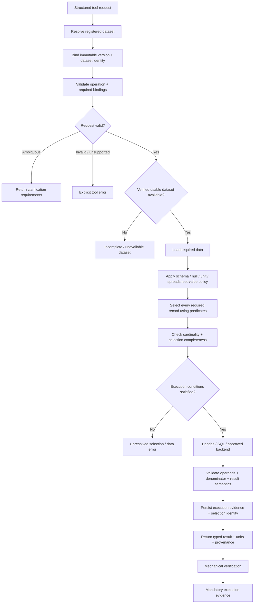
```mermaid
flowchart TD
    REQ["Structured tool request"] --> DS["Resolve registered dataset"]
    DS --> VER["Bind immutable version + dataset identity"]
    VER --> BIND["Validate operation + required bindings"]

    BIND --> VALID{"Request valid?"}
    VALID -->|Ambiguous| CLAR["Return clarification requirements"]
    VALID -->|Invalid / unsupported| ERR["Explicit tool error"]
    VALID -->|Yes| AV{"Verified usable dataset available?"}

    AV -->|No| MISS["Incomplete / unavailable dataset"]
    AV -->|Yes| LOAD["Load required data"]

    LOAD --> POLICY["Apply schema / null / unit / spreadsheet-value policy"]
    POLICY --> SEL["Select every required record using predicates"]
    SEL --> CARD["Check cardinality + selection completeness"]

    CARD --> COND{"Execution conditions satisfied?"}
    COND -->|No| DATAERR["Unresolved selection / data error"]
    COND -->|Yes| EXEC["Pandas / SQL / approved backend"]

    EXEC --> SEM["Validate operands + denominator + result semantics"]
    SEM --> PERSIST["Persist execution evidence + selection identity"]
    PERSIST --> RESULT["Return typed result + units + provenance"]
    RESULT --> MECH["Mechanical verification"]
    MECH --> OUT["Mandatory execution evidence"]
```

### Result semantics

A structured result contains:

```text
operation
selected record IDs
selection predicates
operand evidence IDs
result
units
formula / operator
source version
schema version
execution identity
qualifications
```

It is a **mandatory answer requirement**, not a ranked retrieval candidate.

# 27. CSV/Excel Execution Tool and Safety Contract

The execution tool receives a registered immutable file reference and a validated operation specification. A user-provided path/URL is resolved at upload/registration, not passed as unrestricted filesystem/network authority during chat. Storage resolution occurs inside the authorized workspace and pinned snapshot.

```json
{
  "workspace_id": "ws_1",
  "query_id": "q_42",
  "snapshot_id": "snap_42",
  "requirement_id": "r1",
  "dataset_ref": {
    "source_id": "sheet_1",
    "source_version": 3,
    "registered_file_id": "file_sales_v3",
    "sheet": "Sales",
    "schema_version": "schema-v3"
  },
  "operation": "aggregate",
  "filters": [
    {"column": "region", "operator": "eq", "value": "Europe"},
    {"column": "year", "operator": "eq", "value": 2024}
  ],
  "aggregation": {"operator": "sum", "column": "revenue"},
  "group_by": [],
  "value_policy": {
    "nulls": "error",
    "excel_formulas": "validated_cached_values",
    "currency": "USD"
  }
}
```

Code validates fields, types, cardinality, schema, units, complete dataset coverage and resource limits; then invokes approved pandas methods or a parameterized backend. A formula is a restricted typed AST of allowlisted arithmetic/aggregation operators and named source-backed operands. Never execute arbitrary Python, `eval`, generated shell commands or arbitrary SQL. Upload content, headers and cells are untrusted data and cannot authorize tool actions or change routing policy.

CSV parsing records delimiter, encoding, malformed-row handling, decimal/date formats and type coercions. XLSX records sheet/range identity, header/merged-cell handling, hidden-row policy, date system and formula-value policy. Stale/missing cached formulas require an approved recalculation path or explicit failure; pandas is not an Excel formula engine. Do not execute macros or refresh external workbook links. Preserve the raw file and all accepted row identities. Rejected/unreadable rows affecting a selection prevent a claim of complete aggregation.

Compute over every required record, not top-k chunks or an OKF/Markdown summary. Missing operands prohibit calculation. Empty selection and all-null selection are distinct from a real zero; specify count/sum/mean behavior explicitly. Unit/currency conversion requires a validated rate and effective date. For percentage change, a zero baseline is undefined unless a named domain rule applies; 0-to-0 is not automatically a defined percentage. Use explicit precision/rounding and overflow policies.

Persist full execution lineage, predicates, all selected identities/operands, schema/source versions, result, errors and qualifications. Return a compact execution reference as specified in section 52; large datasets need pagination or a streaming backend, not thousands of rows in model context. Exceeding scan/memory/time limits yields incomplete execution, never a silent sample.

# 28. Generic Structured Operations

Normalize user intent into the section 27 tool schema. The query contract may use a high-level operation such as `sum`; the executor adapter translates it to `operation=aggregate` plus `aggregation.operator=sum`. This is a checked transformation, not two competing tool schemas.

| Operation | Required conditions |
|---|---|
| Lookup | Bound keys and validated cardinality |
| Filter/list | Typed predicates, explicit ordering/pagination and complete selection status |
| Sum/count/min/max/mean | Complete selected coverage and explicit null/empty policies |
| Group-by | Valid dimensions, group completeness and per-group lineage |
| Compare/trend | Bound periods, aligned units/definitions, zero-denominator policy |
| Restricted arithmetic formula | Typed allowlisted AST and every source-backed operand |

The source-agnostic executor returns typed compact results with durable provenance. Structured failure cannot be converted into a narrative estimate.

# 29. Evidence Fusion / RRF

RRF applies only to **compatible ranked discovery candidate lists**.

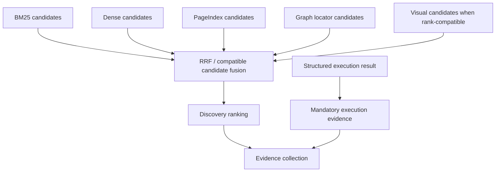
```mermaid
flowchart TD
    BM["BM25 candidates"] --> RRF["RRF / compatible candidate fusion"]
    DV["Dense candidates"] --> RRF
    PI["PageIndex candidates"] --> RRF
    GR["Graph locator candidates"] --> RRF
    VIS["Visual candidates when rank-compatible"] --> RRF

    RRF --> RANK["Discovery ranking"]
    RANK --> EV["Evidence collection"]

    SE["Structured execution result"] --> MAND["Mandatory execution evidence"]
    MAND --> EV
```

RRF:

\[
RRF(d)=\sum_i\frac{1}{k+r_i(d)}
\]

where \(r_i(d)\) is the rank of candidate \(d\) in compatible discovery list \(i\).

### Critical separation

```text
Discovery ranking:
    passages
    sections
    source-backed graph locators
    other rankable candidates

Execution evidence:
    selected rows/cells
    operands
    calculations
    cardinality checks
    complete selections
```

Execution evidence is **retained regardless of RRF score**.

# 30. Adaptive Reranking

Adaptive reranking is **not enabled by an uncalibrated similarity threshold**.

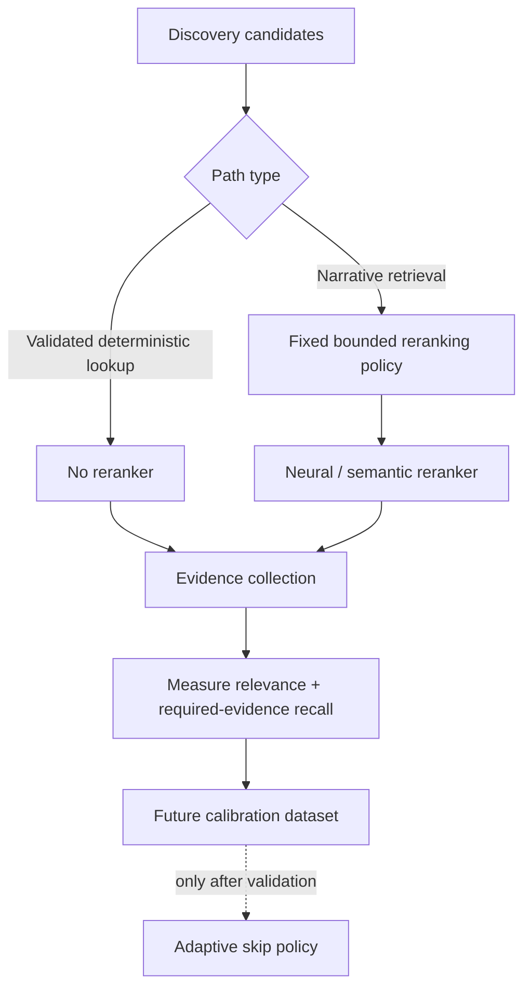
```mermaid
flowchart TD
    C["Discovery candidates"] --> TYPE{"Path type"}

    TYPE -->|Validated deterministic lookup| SKIP["No reranker"]
    TYPE -->|Narrative retrieval| FIXED["Fixed bounded reranking policy"]

    FIXED --> RANK["Neural / semantic reranker"]
    SKIP --> EV["Evidence collection"]
    RANK --> EV

    EV --> MEASURE["Measure relevance + required-evidence recall"]
    MEASURE --> CAL["Future calibration dataset"]
    CAL -. only after validation .-> ADAPT["Adaptive skip policy"]
```

### Initial policy

Skip reranking only for:

```text
uniquely resolved
+
validated
+
deterministic
+
exactly bound
```

For narrative retrieval:

```text
use a fixed top-N candidate set
→ invoke at most one bounded reranking operation per retrieval round, at most two total including the single allowed expansion
→ do not infer confidence from raw similarity alone
```

Track separately:

```text
routing_confidence
retrieval_relevance
extraction_quality
evidence_sufficiency
request_completeness
```

Adaptive skipping becomes allowed only after evaluation demonstrates that it preserves required-evidence recall.

# 31. Evidence Collection

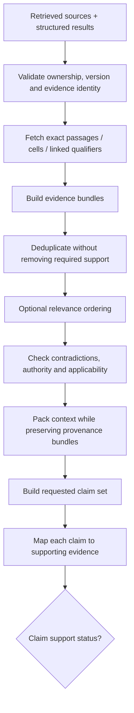
```mermaid
flowchart TD
    C["Retrieved sources + structured results"] --> V["Validate ownership, version and evidence identity"]
    V --> F["Fetch exact passages / cells / linked qualifiers"]
    F --> B["Build evidence bundles"]
    B --> D["Deduplicate without removing required support"]
    D --> O["Optional relevance ordering"]
    O --> X["Check contradictions, authority and applicability"]
    X --> P["Pack context while preserving provenance bundles"]
    P --> CS["Build requested claim set"]
    CS --> MAP["Map each claim to supporting evidence"]
    MAP --> STATUS{"Claim support status?"}
```

---

# 32. Claim and Evidence Validation

Mechanical and semantic verification are independent. Mechanical checks cannot prove the meaning of a paraphrase; a model verifier can still be wrong and must be evaluated.

| Layer | Checks |
|---|---|
| Mechanical | Workspace/access, snapshot and source identity, exact locations, selection/operand identity, schema/types/units and resolvable citation bindings |
| Semantic support | Actual entailment, preserved qualifiers, causal support, applicability and contradictory evidence |
| Final wording | The actual emitted factual statements against bound evidence, after synthesis, plus final citation/access checks |

Pre-answer support checking uses deterministic rules for exact typed facts, validated source excerpts or an evaluated bounded semantic checker. General paraphrases, causal explanations and ambiguous prose require semantic verification; raw retrieval/reranker scores are insufficient. If no evaluated pre-answer checker is available, treat prose claims as provisional until the reserved final verifier checks them. Generation and verification are budgeted through section 17.

Approved deterministic templates render mechanically verified typed results with no extra factual interpretation. Verbatim excerpts retain source attribution and qualifications; they do not convert an unverified source assertion into world truth. Conflict checks and requested coverage still apply.

**Answer support** is the proportion of emitted factual claims supported by bound evidence. **Request completeness** is the proportion of required request elements answered. Track both along with conflict and extraction quality. A supported one-sentence answer to a five-part question is partial, not fully successful.

# 33. Claim Support Matrix

Every claim resolves to:

```text
SUPPORTED
PARTIAL
CONFLICTED
UNSUPPORTED
```

But claim support and request completeness are different.

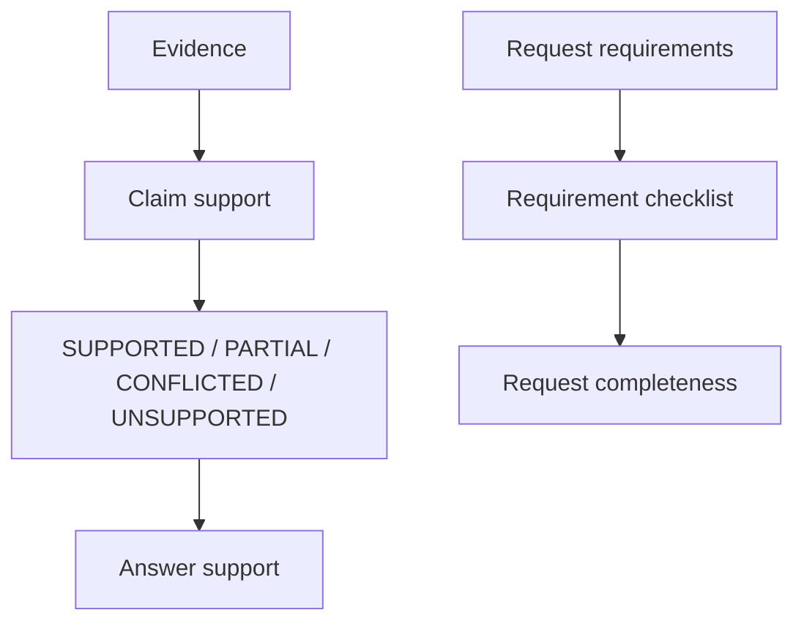
```mermaid
flowchart TB
    Q["Request requirements"] --> REQ["Requirement checklist"]
    E["Evidence"] --> CLAIM["Claim support"]
    CLAIM --> STATUS["SUPPORTED / PARTIAL / CONFLICTED / UNSUPPORTED"]

    REQ --> COMP["Request completeness"]
    STATUS --> SUPPORT["Answer support"]
```

The final answer must expose explicit incompleteness when:

```text
required element missing
OR
support is partial
OR
sources conflict
OR
evidence is unavailable
```

Desired invariant:

```text
No unsupported factual claim is intentionally emitted.
```

This is a **system invariant to enforce and measure**, not a mathematical guarantee that the verifier itself cannot fail.

# 34. LAYA — Bounded Escalation

LAYA may propose initial routing (section 19). Its escalation role activates only when **required evidence is missing or request coverage is incomplete**. Code filters unavailable routes and budgets; on LAYA failure it uses the deterministic missing-requirement policy in section 35.

```mermaid
flowchart TD
    V["Evidence + completeness verification"] --> OK{"Support + completeness sufficient?"}

    OK -->|Yes| DONE["Continue to answer"]
    OK -->|No| BUD{"Expansion budget available?"}

    BUD -->|No| FAIL["Partial answer or explicit insufficiency"]
    BUD -->|Yes| MISS["LAYA proposes missing-requirement route"]

    MISS -->|Location| P["Structural expansion"]
    MISS -->|Exact term| L["Lexical expansion"]
    MISS -->|Semantic concept| D["Dense expansion"]
    MISS -->|Relationship| G["Graph expansion"]
    MISS -->|Rows / cells / operands| S["Approved structured expansion"]

    P --> RET["Targeted retrieval"]
    L --> RET
    D --> RET
    G --> RET
    S --> EXEC["Execute and verify mandatory result"]
    EXEC --> V

    RET --> V
```

Structured expansion uses the approved executor interface and rejoins mandatory execution evidence; it is not sent through discovery RRF.

LAYA receives a **missing-requirement description**, not simply “search again.”

Each expansion has:

```text
max attempts
time deadline
candidate limit
per-model counters and global cost/deadline impact
no-progress detector
cancellation support
```

# 35. LAYA Routing Policy

```text
If missing:
    location
        → structural expansion

If missing:
    exact terminology / identifier
        → lexical expansion

If missing:
    semantic paraphrase
        → dense expansion

If missing:
    relationship / entity path
        → graph expansion

If missing:
    rows / cells / metric / calculation operand
        → structured expansion
```

LAYA should not say:

```text
"search everything again"
```

It should say:

```text
"what specific evidence is missing?"
```

and expand only that dimension.

---

# 36. LAYA Decision State Machine

LAYA returns a typed route/score decision, never answer prose. Code validates the proposed choice and probability/confidence semantics; raw model scores cannot certify evidence sufficiency. Failure uses the deterministic section 35 policy.

```mermaid
stateDiagram-v2
    [*] --> MissingRequirementKnown
    MissingRequirementKnown --> DecisionRequested: decision budget available
    MissingRequirementKnown --> StopOutcome: no budget or no progress
    DecisionRequested --> CodeValidation: typed decision returned
    DecisionRequested --> DefaultPolicy: timeout or invalid decision
    DefaultPolicy --> CodeValidation
    CodeValidation --> SelectedExpansion: authorized ready compatible route
    CodeValidation --> BaselineAlternative: optional route unavailable
    BaselineAlternative --> SelectedExpansion: compatible ready evidence path
    BaselineAlternative --> StopOutcome: required evidence unavailable
    SelectedExpansion --> EvidenceCollection
    EvidenceCollection --> SupportVerification
    SupportVerification --> [*]: return to query coverage decision
    StopOutcome --> [*]: partial, no support or incomplete
```

All retries/decisions/expansions are bounded by the same query reservations, deadline and no-progress detector. Decision-model attempts cannot silently extend the retrieval loop.

# 37. Model Invocation Scheduling

Every model operation passes a pre-invocation gate. Section 17 is the authoritative budget contract; this applies to LAYA, query embedding, reranking, generation and semantic verification.

```mermaid
flowchart TD
    P["Proposed model operation"] --> T["Classify operation and estimate usage"]
    T --> B{"Atomic reservation preserves finishing budget?"}
    B -->|No| F["Deterministic fallback, clarification or insufficiency"]
    B -->|Yes| I["Invoke authorized model with bounded input"]
    I --> L["Record attempt, cost, tokens and latency"]
    L --> V["Validate typed output or generated claims"]
    V --> N["Continue requirement workflow"]
```

The default free-form path reserves synthesis and final semantic verification before optional generative planning/tree reasoning. An encoder reranker uses its own bounded counter. Using an LLM to rerank consumes a generation slot instead. If an optional operation cannot fit, use ready baseline retrieval, a deterministic parser or clarification. Never charge a model after allowing it to overspend. LAYA decisions are validated proposals and are logged; LAYA does not generate user-facing text.

# 38. LLM Context Contract

The LLM receives only the evidence needed for its operation.

```json
{
  "query_id": "q_123",
  "workspace_id": "ws_1",
  "snapshot_id": "snap_42",
  "question": "...",
  "requirements": [
    {
      "requirement_id": "r1",
      "description": "...",
      "status": "SUPPORTED"
    }
  ],
  "evidence": [
    {
      "evidence_id": "ev_12",
      "source_id": "doc_1",
      "source_version": 7,
      "location": "page 73",
      "text": "...",
      "support_status": "ASSERTED"
    }
  ],
  "instructions": {
    "do_not_add_unsupported_facts": true,
    "preserve_qualifiers": true,
    "preserve_conflicts": true,
    "bind_claims_to_evidence": true
  }
}
```

For synthesis, the model must not be given an unbounded corpus dump.

For query planning, it receives schema/capability metadata and the user request, not arbitrary private source content unless needed and authorized.

# 39. Answer Construction

Select one answer mode after the requirement join. Exact calculations/comparisons use approved deterministic templates. Narrative/conflict explanation uses synthesis only when both generation and final semantic validation are reserved.

```mermaid
flowchart TD
    E["Evidence and requirement status"] --> M{"Answer mode?"}
    M -->|Typed result or approved excerpt| D["Deterministic template"]
    M -->|Free-form with finishing budget| G["Bounded LLM synthesis"]
    G --> S["Verify actual final claims and qualifiers"]
    S -->|Supported| F["Final citation, completeness and access checks"]
    S -->|Unsupported| B["Safe verified template or explicit failure"]
    D --> F
    B --> F
    F -->|Pass| O["Complete or partial answer with provenance"]
    F -->|Fail| X["Scoped validation or access failure"]
```

Preserve support status, unresolved requirements, conflicts, qualifications, units, source versions and provenance. Partial answers must name missing parts. Deterministic trend text can describe a computed change, but cannot infer why it happened. A safe fallback cannot bypass final validation or claim full completeness.

# 40. Deterministic Math

For two observations:

\[
\%\Delta =
\frac{x_{new}-x_{old}}
{x_{old}}\times100
\]

For a time series:

\[
Trend =
\frac{x_t-x_{t-k}}
{x_{t-k}}\times100
\]

For weighted average:

\[
\bar{x}_w =
\frac{\sum_i w_i x_i}
{\sum_i w_i}
\]

For cosine similarity:

\[
cos(q,d)=
\frac{q\cdot d}
{\|q\|\|d\|}
\]

All operands must retain provenance. Zero denominators in trend/weighted mean and zero-norm vectors need explicit undefined/error handling; apply the section 27 value policy rather than silently returning a numeric value.

---

# 41. Example Dry Run A — Exact Table Question

Question:

> What was Europe revenue in 2024?

Assume the user/session has already selected the company and fiscal-year definition.

```mermaid
sequenceDiagram
    participant U as User
    participant P as Planner
    participant K as Knowledge Map
    participant S as Structured Executor
    participant V as Validator

    U->>P: Europe revenue in 2024
    P->>K: Resolve metric + dimensions
    K-->>P: Revenue table + Europe + 2024 locator
    P->>S: lookup(metric=revenue, region=Europe, year=2024)
    S-->>V: typed result + selected records + provenance
    V->>V: mechanical verification
    V->>V: semantic/support verification
    V-->>U: deterministic answer + citation
```

Expected:

```text
Generation calls: 0
RRF: no
Reranker: no
Structured result: mandatory
```

# 42. Example Dry Run B — Semantic Explanation

Question:

> Why did revenue decline?

This question is **not fully bound** unless session context or clarification establishes:

```text
entity/company
comparison period
revenue definition
scope
```

Correct workflow:

```mermaid
flowchart TD
    Q["Why did revenue decline?"] --> BIND["Resolve company + periods + revenue definition"]
    BIND --> D{"Bindings complete?"}

    D -->|No| CLAR["Ask targeted clarification"]
    D -->|Yes| KM["Knowledge Map"]

    KM --> R["Graph + BM25 + dense + structural"]
    R --> EV["Fetch exact evidence"]
    EV --> CV["Semantic + mechanical verification"]

    CV --> REL{"Causal support actually exists?"}
    REL -->|Yes| LLM["Bounded synthesis"]
    REL -->|No| NO["Report supported decline only; causal requirement missing"]
    NO --> FINAL

    LLM --> FINAL["Final semantic, citation and access validation"]
```

The system must distinguish:

```text
Revenue declined.
```

from:

```text
Source X explicitly attributes the decline to Y.
```

and from:

```text
Y happened near the same time.
```

Temporal correlation is not automatically causation.

# 43. Example Dry Run C — Retrieval Failure → LAYA

```mermaid
sequenceDiagram
    participant P as Planner
    participant K as KM
    participant R as Retrieval
    participant V as Verify
    participant L as LAYA

    P->>K: Resolve required evidence
    K-->>P: Weak / partial map coverage
    P->>R: Initial targeted retrieval
    R-->>V: Insufficient support for requirement r2
    V->>L: Missing requirement = exact section / evidence
    L->>K: Request structural expansion
    K-->>L: Candidate sections
    L->>R: Targeted retrieval
    R-->>V: New evidence
    V->>V: Revalidate
    V-->>P: Requirement r2 supported OR explicit failure
```

If expansion makes no progress or exhausts budget:

```text
return partial/explicit insufficiency
```

Never fabricate completion.

# 44. End-to-End Dry Run — Mixed Source

Suppose the workspace contains:

```text
annual_report.pdf
sales.xlsx
architecture.md
```

Question:

> Compare 2024 Europe revenue with the architecture change that affected the sales platform.

This is **not automatically a causal question with an answer**.

The system first decomposes the request into requirements:

```text
R1 = 2024 Europe revenue
R2 = architecture change
R3 = evidence that the architecture change affected the sales platform
R4 = requested comparison/relationship, combined with R3 if identical
```

```mermaid
flowchart TD
    Q["Mixed-source question"] --> P["Planner"]
    P --> R1["R1: sales.xlsx structured lookup"]
    P --> R2["R2: architecture.md retrieval"]
    P --> R3["R3 and R4: causal and relationship requirements"]

    R1 --> SE["Structured executor"]
    R2 --> RET["BM25 + dense + PageIndex"]
    R3 --> GR["Graph/OKF + targeted evidence"]

    SE --> JOIN["Requirement join"]
    RET --> JOIN
    GR --> JOIN

    JOIN --> V["Claim + completeness verification"]
    V --> D{"Does source explicitly support causal relationship?"}

    D -->|Yes| LLM["Bounded synthesis"]
    D -->|No| PART["Supported facts only; causal requirement marked missing"]

    LLM --> FINAL["Final semantic, citation and access validation"]
    PART --> FINAL
```

Finding two events is not proof that one caused the other.

# 45. Versioning

Versioning applies independently to baseline and enrichment artifacts.

```mermaid
flowchart TD
    SRC["Source v7"] --> E["Canonical evidence v7"]

    E --> BASE["Baseline artifacts v7"]
    BASE --> BSNAP["Baseline snapshot v7"]

    E --> ENR["Optional enrichment v7"]
    ENR --> ESNAP["Enriched snapshot v7"]

    BSNAP --> PUB["Generation-checked atomic publication"]
    ESNAP --> PUB
    PUB --> ACTIVE["Active snapshot"]
```

A query pins **one complete active snapshot**.

Do not mix:

```text
source v7
+
BM25 v6
+
Knowledge Map v8
```

unless an explicit compatibility contract permits it.

An enrichment failure does not invalidate a valid baseline snapshot. All publication follows section 47; an old enrichment job cannot directly change the active pointer. All publication follows section 47; an old enrichment job cannot directly change the active pointer. All publication follows section 47; an old enrichment job cannot directly change the active pointer.

# 46. Version-Aware Cache

Cache keys must include authorization and session context, not just query text.

\[
CacheKey =
H(
workspace,
authorized\_principal\_scope,
session\_context\_hash,
query\_hash,
source\_version\_set,
snapshot\_version,
capability\_policy\_version,
access\_policy\_version
)
\]

For user/session-dependent retrieval, include the relevant:

```text
workspace
principal/access scope
session selected-source set
session variables that affect interpretation
source versions
snapshot
policy
```

Never allow a cache hit to bypass authorization or deletion checks.

Final delivery should still recheck access/deletion state for sensitive data.

# 47. Replacement, Deletion and Concurrent Publication

Publication uses immutable artifacts and an atomic workspace manifest pointer. Source version, baseline generation, enrichment generation and workspace manifest generation are separate identities.

```mermaid
flowchart TB
    N["Register new immutable source version"] --> B["Build affected baseline in staging"]
    B --> Q{"Baseline QA passes?"}
    Q -->|No| K["Keep previous usable baseline and report failure"]
    Q -->|Yes| P["CAS publish compatible workspace manifest"]
    P --> A["New baseline active; queryable"]
    A --> E["Build optional affected enrichment"]
    E --> V["Validate support, versions and generation"]
    V --> C{"Expected source and active generation still match?"}
    C -->|Yes| EP["CAS extend active baseline with enrichment"]
    C -->|No| S["Discard stale artifact or rebuild against current source"]
    D["Delete or revoke source"] --> T["Atomic tombstone and access barrier"]
    T --> X["Cancel jobs, invalidate caches and dependent support"]
```

`CAS` means compare-and-swap (or an equivalent transactional check). A publisher reads the current manifest, merges only its compatible source delta, and commits with `expected_manifest_generation`. A conflict triggers a bounded re-read/revalidation/merge; it never blindly replaces the whole manifest. Parallel document uploads must preserve each other's changes.

Each job carries workspace/source/version, artifact dependencies, expected source generation and idempotency key. Enrichment for v7 cannot overwrite baseline v8, change the active source back to v7, or revive a tombstone. Cross-source graph edges retain all supporting source versions; changed support makes affected edges unavailable until rebuilt. Only artifacts compatible with the new baseline can be included at activation; changed enrichment may follow asynchronously. Unaffected artifacts can be reused when dependency hashes match.

Deletion/revocation is an immediate authorization barrier, even for already pinned snapshots, caches and resumed jobs. Physical cleanup can follow asynchronously. Query execution pins an immutable snapshot; ordinary replacement does not mix versions mid-query. Final delivery rechecks access/tombstones. Resume rechecks source/access/generation and restarts invalid dependent steps; it does not publish merely because a checkpoint exists.

Publication tests must cover old enrichment finishing after replacement, parallel uploads, publication conflict, deletion during extraction, deletion during answer construction and retry after a committed publish.

# 48. Immutable Workspace Snapshot

A snapshot binds the complete compatible workspace state; each query pins one snapshot ID.

| Field | Contract |
|---|---|
| `workspace_id`, `snapshot_id`, `manifest_generation` | Immutable workspace identity and publication generation |
| Source-version set | Exact active immutable source versions and tombstones |
| Baseline/enrichment artifacts | Source-dependent compatible generations, coverage and failure states |
| Index/schema/map versions | Exact artifact and embedding compatibility metadata |
| Policy versions | Routing, budgets, extraction/execution semantics and authorization scope |

Section 47 controls atomic publication. Access and deletion are rechecked during use/delivery even when snapshot content is immutable. An ordinary source replacement may allow an already pinned query to complete on its old consistent snapshot, with source versions visible; a deletion/revocation does not.

# 49. Data Interfaces — Ingestion → Knowledge Plane

### CanonicalEvidence

This is the prose variant of section 7. Required identity/provenance/support fields are shared; quality confidence is illustrative and not a calibrated rejection threshold. Structured numeric content uses the same record shape with a typed `content` value and unit.

```json
{
  "workspace_id": "ws_1",
  "evidence_id": "ev_1",
  "source_id": "doc_1",
  "source_version": 7,
  "type": "paragraph",
  "location": {
    "page": 12,
    "section": "3.2"
  },
  "content": "...",
  "unit": null,
  "qualifiers": {},
  "support_status": "ASSERTED",
  "provenance": {
    "content_hash": "sha256:...",
    "extraction_pipeline_version": "parse-v5"
  },
  "quality": {
    "status": "VALID",
    "confidence": 0.98
  }
}
```

### EnrichmentOutput

```json
{
  "workspace_id": "ws_1",
  "source_id": "doc_1",
  "source_version": 7,
  "based_on_baseline_generation": 7,
  "enrichment_generation": 1,
  "derived_entities": [],
  "derived_facts": [],
  "derived_relations": [],
  "structure": [],
  "supporting_evidence_ids": ["ev_1"],
  "enrichment_status": "PARTIAL"
}
```

### CapabilityArtifact

```json
{
  "workspace_id": "ws_1",
  "source_id": "doc_1",
  "source_version": 7,
  "artifact_id": "dense_doc_1_v7",
  "artifact_version": "dense-v7",
  "baseline_generation": 7,
  "capability": "semantic_search",
  "ready": true,
  "coverage": "chunks_1_620",
  "exclusions": [],
  "pipeline_version": "embed-v4",
  "failure_state": null
}
```

# 50. Data Interfaces — Knowledge Map → Planner

```json
{
  "workspace_id": "ws_1",
  "snapshot_id": "snap_42",
  "source_id": "doc_1",
  "source_version": 7,
  "match": {
    "concept": "revenue",
    "routing_confidence": 0.94
  },
  "locations": [
    {
      "kind": "table_cell",
      "table_id": "t17",
      "row": "Europe",
      "column": "2024",
      "evidence_id": null
    }
  ],
  "capabilities": [
    {
      "name": "structured_lookup",
      "ready": true,
      "coverage": "sales!A1:Z5000"
    }
  ]
}
```

`evidence_id` may be null when the locator is a routing hint rather than a fetched evidence record.

The planner must never interpret:

```text
no locator
```

as:

```text
no evidence exists
```

# 51. Data Interfaces — Planner → Retrieval Coordinator

```json
{
  "query_id": "q_42",
  "workspace_id": "ws_1",
  "snapshot_id": "snap_42",
  "mode": "targeted",
  "discovery_retrievers": [
    {
      "name": "bm25",
      "priority": 1,
      "scope": {
        "source_id": "doc_1",
        "source_version": 7,
        "section_ids": ["sec_7"]
      }
    },
    {
      "name": "dense",
      "priority": 2,
      "scope": {
        "source_id": "doc_1",
        "source_version": 7
      }
    }
  ],
  "structured_operations": [],
  "required_evidence_requirements": [
    {
      "requirement_id": "r1",
      "kind": "narrative_support",
      "locator": null,
      "selection": null
    }
  ],
  "join_policy": "all_selected_terminate_or_deadline",
  "budget_policy_id": "query-default-v3",
  "max_expansion_steps": 1,
  "deadline_ms": 15000
}
```

Structured operations are passed through their own interface, not inserted into discovery ranking. The 15-second deadline is an illustrative development policy, not a latency guarantee; the scheduler derives branch/model deadlines from the configured overall deadline.

# 52. Data Interfaces — Retrieval and Execution → Validator

### Discovery candidate

```json
{
  "workspace_id": "ws_1",
  "query_id": "q_42",
  "snapshot_id": "snap_42",
  "requirement_ids": ["r2"],
  "candidate_id": "cand_91",
  "source_id": "doc_1",
  "source_version": 7,
  "artifact_version": "bm25-v7",
  "locator": {"chunk_id": "ch_91", "page": 73},
  "retriever": "bm25",
  "rank": 1,
  "score": 12.42,
  "branch_status": "COMPLETE"
}
```

### Compact structured execution evidence

```json
{
  "workspace_id": "ws_1",
  "query_id": "q_42",
  "snapshot_id": "snap_42",
  "requirement_id": "r1",
  "execution_id": "exec_7",
  "execution_record_ref": "execution:ws_1:exec_7",
  "source_id": "sheet_1",
  "source_version": 3,
  "schema_version": "schema-v3",
  "operation": "sum",
  "metric": "revenue",
  "selection": {"region": "Europe", "year": 2024},
  "selection_identity": {
    "records_examined": 5000,
    "records_matched": 2,
    "selection_digest": "sha256:...",
    "lineage_ref": "execution:ws_1:exec_7:lineage"
  },
  "result": {"value": 184, "unit": "USD"},
  "coverage_status": "COMPLETE_FOR_SELECTION",
  "qualifications": [],
  "status": "VERIFIED"
}
```

The durable execution record contains every selected record ID, operand locator/value/unit, operator/AST, source content hash, schema/backend/policy versions, selection completeness audit and output. The compact record is mandatory evidence and has no RRF rank. Validators resolve its authorized lineage reference; a digest alone does not prove correctness or provide a citation.

User-facing aggregate citations identify the file/version, sheet/range and filters, with a resolvable execution reference for detailed lineage. Models receive compact results and needed explanatory operands only. Full row sets stay in durable provenance and can be paginated for inspection. Large selections are never silently truncated to fit context.

# 53. Data Interfaces — Evidence → Answer

```json
{
  "workspace_id": "ws_1",
  "query_id": "q_42",
  "snapshot_id": "snap_42",
  "requirements": [
    {
      "requirement_id": "r1",
      "status": "SUPPORTED",
      "supporting_evidence_ids": ["ev_91"]
    },
    {
      "requirement_id": "r2",
      "status": "PARTIAL",
      "supporting_evidence_ids": ["ev_92"]
    }
  ],
  "claims": [
    {
      "claim_id": "c1",
      "text": "Europe revenue was ...",
      "support": ["ev_91"],
      "status": "SUPPORTED"
    }
  ],
  "answer_mode": "deterministic",
  "provenance": {
    "source_versions": {
      "sheet_1": 3,
      "doc_1": 7
    }
  }
}
```

The answer cannot report `COMPLETE` if any required requirement remains unresolved.

# 54. Complete Query State Machine

The query owns a requirement ledger. A mixed query may dispatch both execution and discovery; the join retains mandatory structured results and branch-completeness status. Expansion returns to evidence collection and verification.

```mermaid
stateDiagram-v2
    [*] --> Authorized
    Authorized --> SnapshotPinned
    SnapshotPinned --> ContractBuilt
    ContractBuilt --> Clarification: material ambiguity
    ContractBuilt --> Unsupported: illegal operation
    ContractBuilt --> RequirementsPlanned: bindings valid
    RequirementsPlanned --> SelectedPathsExecuting
    SelectedPathsExecuting --> RequirementJoin: all selected terminate or deadline
    RequirementJoin --> EvidenceVerification
    EvidenceVerification --> CoverageDecision
    CoverageDecision --> AnswerReady: complete and supported
    CoverageDecision --> BoundedExpansion: missing and progress possible
    BoundedExpansion --> RequirementsPlanned: ready routes and reserved budget
    BoundedExpansion --> StopDecision: unavailable or budget exhausted
    CoverageDecision --> StopDecision: deadline or no progress
    StopDecision --> PartialAnswerReady: some independently supported requirements
    StopDecision --> NoSupport: completed scoped search without support
    StopDecision --> Incomplete: failed or unavailable required search
    AnswerReady --> AnswerMode
    PartialAnswerReady --> AnswerMode
    AnswerMode --> DeterministicAnswer: approved template
    AnswerMode --> LLMSynthesis: synthesis and final verifier reserved
    LLMSynthesis --> FinalSemanticValidation
    FinalSemanticValidation --> FinalMechanicalValidation: supported wording
    FinalSemanticValidation --> SafeFallback: unsupported wording
    SafeFallback --> FinalMechanicalValidation: verified template or excerpts
    SafeFallback --> Incomplete: no safe supported output
    DeterministicAnswer --> FinalMechanicalValidation
    FinalMechanicalValidation --> Delivered: citations and access valid
    FinalMechanicalValidation --> ExplicitFailure: invalid or revoked
    Delivered --> [*]
    Clarification --> [*]
    Unsupported --> [*]
    NoSupport --> [*]
    Incomplete --> [*]
    ExplicitFailure --> [*]
```

Partial delivery names unanswered requirement IDs and reasons. Missing operands never yield a partial calculation; other independently supported results may still be delivered. `NO_SUPPORT` means no support found in the searched scope, not a claim that the entire world/corpus lacks the answer. Failed/deadline-limited coverage is `RETRIEVAL_INCOMPLETE`. Final failure cannot leak unvalidated drafts. Status messages may stream; factual content waits for final validation.

# 55. Discovery Retrieval State Machine

Structured execution is separate and joins by requirement ID. Discovery has an explicit fan-in barrier.

```mermaid
stateDiagram-v2
    [*] --> Planned
    Planned --> BudgetReserved
    BudgetReserved --> SelectedBranchesRunning
    SelectedBranchesRunning --> BranchJoin: all terminate or deadline
    BranchJoin --> CompatibleFusion
    CompatibleFusion --> NarrativeRerank: narrative policy and reserved batch
    CompatibleFusion --> EvidenceFetch: deterministic locator path
    NarrativeRerank --> EvidenceFetch
    EvidenceFetch --> Verification
    Verification --> Complete: requirement support and necessary coverage
    Verification --> Expansion: missing and progress possible
    Expansion --> Planned: bounded targeted ready route
    Expansion --> Incomplete: unavailable or exhausted
    Verification --> NoSupport: completed scoped search without support
    Verification --> Incomplete: failed or timed-out required coverage
    Complete --> [*]
    NoSupport --> [*]
    Incomplete --> [*]
```

Graph traversal retrieves supported locators, then fetches their exact source evidence. An inferred relationship cannot be the sole proof of an emitted factual claim. Narrative ranking never drops mandatory execution evidence or required conflict/coverage checks.

# 56. Cost Model

## 56.1 Large-Corpus Operational Architecture

Logical routing is not sufficient for large sources. Every expensive operation must have bounded work, resumability and cancellation.

```mermaid
flowchart TB
    SRC["Large source"] --> Q["Durable ingestion queue"]
    Q --> BP["Backpressure / concurrency controller"]
    BP --> BATCH["Bounded page / token / row / asset batches"]

    BATCH --> CK["Checkpoint"]
    CK --> WORK["Idempotent extraction worker"]
    WORK --> STORE["Canonical evidence store"]

    STORE --> IDX["Partitioned index builders"]
    IDX --> READY["Atomic partition publication"]

    WORK --> ERR{"Transient failure?"}
    ERR -->|Yes| RETRY["Bounded retry + backoff"]
    RETRY --> CK
    ERR -->|No| FAIL["Dead-letter / explicit failure"]

    READY --> SNAP["Snapshot publication"]
    SNAP --> CANCEL["Cancellation / deadline controller"]

    CANCEL --> DONE["Completed bounded job"]
```

### Required hard limits

Every pipeline declares:

```text
max_file_bytes
max_pages_per_batch
max_extracted_tokens_per_batch
max_rows_per_batch
max_assets_per_batch
max_nested_object_depth
max_table_cells
max_chunk_bytes/tokens
max_concurrent_workers
max_queue_age
max_retry_attempts
max_total_runtime
max_branch_runtime
max_candidates
max_expansion_steps
max_no_progress_steps
```

### Checkpoint granularity

A checkpoint should be small enough to resume without repeating the whole source:

```text
document → page range
spreadsheet → sheet + row range
JSON → object/page cursor
repository → file batch
HTML → page/DOM batch
visual → asset batch
indexing → partition
```

Checkpoint state must include:

```text
job_id
workspace_id
source_id
source_version
pipeline_version
partition/batch cursor
completed artifacts
input hash
output hashes
attempt count
last progress timestamp
```

### Retry and backpressure

Use at most three total attempts for retry-safe transient failures, subject to global deadline and cost limits. Then choose an already prepared compatible lexical/vector/canonical-text fallback where it supports the requirement. Never build document embeddings during the question or treat failed parsing as usable raw text.

```text
transient failure
→ bounded exponential backoff
→ retry
→ checkpoint

persistent failure
→ dead-letter / failed state

queue overload
→ reduce concurrency
→ preserve ordering where required
→ do not accept unbounded memory growth
```

### Partitioning

Indexes and stores should be partitionable by metadata such as:

```text
workspace
source
source version
document
tenant/authorization boundary
time/version where applicable
```

Query routing must apply metadata filters before expensive candidate retrieval whenever possible.

### Exhaustive-list workflow

“List all X” is **not** a top-k retrieval problem.

```mermaid
flowchart TD
    Q["Exhaustive request"] --> CAP["Check capability + coverage"]
    CAP --> CUR["Create deterministic cursor"]
    CUR --> PAGE["Read bounded page"]
    PAGE --> ADD["Accumulate unique source-backed records"]
    ADD --> MORE{"More records?"}
    MORE -->|Yes| CUR
    MORE -->|No| COMPLETE["Completeness check"]
    COMPLETE --> ANSWER["Return complete list + coverage metadata"]
```

The system must not answer “all” from a top-k vector/BM25 result.

### Whole-document summary workflow

Whole-document summary is a separate bounded workflow:

```mermaid
flowchart TD
    Q["Whole-document summary"] --> COVER["Enumerate document structure"]
    COVER --> BATCH["Bounded section batches"]
    BATCH --> SUM["Deterministic extraction / bounded summaries"]
    SUM --> MERGE["Evidence-preserving hierarchical merge"]
    MERGE --> CHECK["Coverage + contradiction check"]
    CHECK --> FINAL["Summary with source coverage"]
```

The summary is derived from source-backed evidence and must retain coverage metadata. A partial summary must not be presented as exhaustive. Reuse version-compatible prepared section summaries where available; their source references and coverage remain mandatory. Newly generated query-time section summaries/merges consume the section 17 ledger. If full coverage needs more calls than the interactive policy permits, offer an explicit bounded asynchronous summary job with its own policy, or return a scoped partial summary; do not hide extra calls under retrieval.

### Session-aware cache

For large-corpus retrieval, cache identity must include:

```text
workspace
principal/access scope
session context
selected source set
source version set
snapshot version
capability policy
query
pagination/cursor state
```

This prevents a result generated for one authorized session or source set from being reused in another.

## 56.2 Cost Model

Approximate query cost:

\[
C_q =
C_{planning}
+
C_{retrieval}
+
C_{rerank}
+
C_{verification}
+
C_{LLM\_synthesis}
+
C_{storage/read}
\]

Cost is also constrained by:

```text
query wall-clock deadline
retrieval branch budget
candidate budget
LLM call budget
LLM token budget
expansion budget
```

Ingestion/enrichment has a separate cost envelope:

```text
ingestion compute budget
enrichment LLM budget
per-document size limits
batch limits
queue backlog limits
```

# 57. Latency Model

Sequential latency:

\[
T_{seq}=\sum_i T_i
\]

Independent discovery branches:

\[
T_{parallel}\approx\max(T_{BM25},T_{Dense},T_{PageIndex},T_{Graph},T_{Visual})
\]

Total query latency is bounded by:

\[
T_q \approx
T_{auth}
+
T_{plan}
+
T_{route}
+
T_{parallel}
+
T_{fusion}
+
T_{verify}
+
T_{answer}
\]

For each branch:

```text
deadline
cancellation token
maximum candidates
maximum pages/rows/records
maximum expansion steps
```

When the branch deadline expires, the coordinator returns a partial branch result instead of waiting indefinitely.

# 58. Model Cost Accounting

Section 17 owns model counters. Under its default policy, generation calls per query are at most two; encoder reranking/verification, query embeddings and LAYA decision calls have separate bounded counters. An LLM used as a reranker/verifier still consumes a generation slot.

Measure total cost as the sum of every model/tool invocation's actual billable usage plus retrieval/storage compute. Track input/output tokens, batch sizes, failed attempts and retries by operation, as well as query wall-clock time. No operation is free merely because it produces zero text tokens.

Free-form synthesis and a final generative verifier use both default generation slots. Exact templates can use zero. More complex plans may need clarification or an explicit policy change; never silently exceed the default. Ingestion/enrichment/summary preparation has a separate ledger, including amortized per-source cost.

# 59. Retrieval Quality Model

Confidence examples are illustrative and must be calibrated against labeled evaluation data. A raw LAYA probability or a proposed “below 10” threshold is not a validated rejection rule. Reject for insufficient support after the appropriate bounded coverage checks, not solely from a routing score or document summary.

Quality must be measured as separate dimensions.

### Routing

\[
RoutingAccuracy=
\frac{\# correctly\ selected\ capability\ paths}
{\# routed\ queries}
\]

### Discovery relevance

Measure with:

```text
Recall@K
MRR
nDCG
Precision@K
```

### Required-evidence recall

\[
RequiredEvidenceRecall=
\frac{\# required\ evidence\ requirements\ found}
{\# required\ evidence\ requirements}
\]

### Answer support

\[
SupportRate=
\frac{\# supported\ emitted\ factual\ claims}
{\# emitted\ factual\ claims}
\]

### Request completeness

\[
CompletenessRate=
\frac{\# answered\ required\ requirements}
{\# total\ required\ requirements}
\]

### Extraction quality

Track separately:

```text
parse success
schema validity
OCR quality
table extraction accuracy
location accuracy
coverage
```

No single “confidence” score should replace these measurements.

# 60. Hallucination-Control Pipeline

```mermaid
flowchart TB
    Q["Question"] --> REQ["Requirement extraction"]
    REQ --> PLAN["Plan"]
    PLAN --> RET["Retrieve / execute"]
    RET --> EV["Canonical evidence + execution records"]
    EV --> M["Mechanical verification"]
    M --> S["Semantic support verification"]
    S --> CLAIM["Supported claim set"]
    CLAIM --> LLM["Optional bounded synthesis"]
    LLM --> FINAL["Final claim + completeness validation"]
    FINAL --> OUT["Validated answer"]
```

The desired invariant is:

> **No unsupported factual claim is intentionally emitted by the answer layer.**

This is not treated as a proven mathematical guarantee. The verification components themselves are evaluated for false positives and false negatives.

# 61. Context Compression

Compression must preserve evidence.

A safe transformation is:

```text
large source
    ↓
relevant evidence
    ↓
provenance bundle
    ↓
compact context
```

Not:

A summary cannot replace source-backed evidence as factual proof.

The compressed context must retain:

```text
evidence_id
source_id
source_version
location
qualifiers
units
support status
```

---

# 62. Canonical Retrieval Paths

## Path A — Exact structured

```text
Query
→ Knowledge Map
→ structured executor
→ selected records/cells
→ mechanical + semantic verification
→ deterministic answer
```

## Path B — Known section

```text
Query
→ Knowledge Map
→ PageIndex
→ exact section
→ evidence collection
→ verification
→ answer
```

## Path C — Semantic text

```text
Query
→ Knowledge Map
→ BM25 + dense
→ compatible fusion
→ bounded rerank
→ verification
→ answer
```

## Path D — Relationship

```text
Query
→ Knowledge Map
→ ready graph / OKF or compatible baseline text fallback
→ source-backed locators
→ targeted text retrieval
→ verification
→ answer
```

## Path E — Unknown

```text
Query
→ minimal map / capability registry
→ bounded discovery
→ BM25 + dense + structural + graph as applicable
→ compatible fusion
→ verification
→ LAYA if needed
```

## Path F — Mixed structured + narrative

```text
Query
→ requirement decomposition
→ structured execution for numeric/data requirements
→ discovery retrieval for narrative requirements
→ join mandatory execution evidence + ranked discovery evidence
→ verification
→ answer
```

# 63. Master Routing Matrix

| Question shape | Primary | Secondary | RRF? | Generation policy |
|---|---|---|---|---|
| Exact cell/value | Structured | none | No | 0 |
| Filtered lookup | Structured | none | No | 0 |
| Aggregate | Structured | none | No | 0 |
| Compare numeric values | Structured | evidence retrieval | Only narrative candidates | 0 |
| Trend | Structured | evidence retrieval | Only narrative candidates | 0 |
| Known section | Ready structural locator | BM25/dense fallback | Yes if compatible ranked candidates | 0 for excerpts; free-form follows section 17 |
| Exact identifier | BM25 | dense | Yes | 0 |
| Semantic concept | Dense | BM25 | Yes | 0 for approved templates; 2 for free-form synthesis + final generative verifier |
| Relationship | Graph/OKF | BM25/dense | Yes for discovery candidates | 0 for approved templates; 2 for free-form synthesis + final generative verifier |
| Chart question | Visual | structural | Only if compatible candidates | 0 for approved templates; 2 for free-form synthesis + final generative verifier |
| “Why” explanation | Graph + text | dense/BM25 | Yes | 2 for synthesis + final generative verifier |
| Unknown | bounded discovery | selected branches | Yes | 0 for approved templates; 2 for free-form synthesis + final generative verifier |
| Ambiguous request | clarification / validated planning proposal | capability map | No | 0 for clarification; optional planning uses 1 |

Structured execution results are never RRF-ranked away. Counts assume bound requests and a configured encoder reranker where needed; generative planning/reranking/verification all consume generation slots under section 17. These routes remain subject to readiness and per-requirement coverage.

# 64. Failure Semantics

Never silently convert failure into an answer.

```text
INVALID_REQUEST
AMBIGUOUS_REQUEST
UNAUTHORIZED
SOURCE_UNAVAILABLE
VERSION_CONFLICT
SCHEMA_ERROR
SELECTION_INCOMPLETE
RETRIEVAL_INCOMPLETE
NO_SUPPORT
CONFLICTED_SUPPORT
LLM_VALIDATION_FAILED
DELETED_SOURCE
BUDGET_EXHAUSTED
NO_PROGRESS
```

Query terminal status is separate from error detail: `COMPLETE`, `PARTIAL`, `NO_SUPPORT`, `RETRIEVAL_INCOMPLETE`, `CLARIFICATION_REQUIRED` or `FAILED`. A partial response includes missing requirement IDs and reasons; `NO_SUPPORT` requires completed bounded searched scope. Retrying a transient error does not change these semantics.

Every error should remain machine-readable.

---

# 65. Security / Authorization Boundary

```mermaid
flowchart TD
    Q["Query"] --> AUTH["Workspace + principal authorization"]
    AUTH --> SESSION["Resolve session context"]
    SESSION --> SNAP["Resolve authorized active snapshot"]
    SNAP --> ROUTE["Routing"]
    ROUTE --> RET["Retrieval / execution"]
    RET --> EV["Evidence fetch"]
    EV --> ACCESS["Recheck access + deletion + version"]
    ACCESS --> ANSWER["Answer"]
```

Authorization-aware cache identity includes:

```text
workspace
principal/access scope
session context
source version set
snapshot
policy version
```

A cache hit must never bypass final authorization/deletion checks.

# 66. Idempotency

Ingestion jobs should be keyed by immutable identity.

\[
JobKey =
H(workspace, source\_id, source\_version, content\_hash, pipeline\_version, operation\_policy\_version)
\]

If the same job arrives twice:

```text
same JobKey
→ resume / return existing result
```

rather than duplicate all derived artifacts.

---

# 67. Dependency Graph

Only affected dependencies need rebuilding. All retained artifacts must match the source-version set bound by the new snapshot.

```mermaid
flowchart TB
    R["Immutable source version"] --> C["Canonical evidence"]
    C --> B["Baseline indexes, datasets and locators"]
    C --> E["Optional OKF, PageIndex and graph"]
    B --> M["Baseline navigation map"]
    M --> S["Baseline snapshot candidate"]
    M --> EM["Compatible enriched map"]
    E --> EM
    EM --> ES["Enriched snapshot candidate"]
    S --> P["Generation-checked atomic publisher"]
    ES --> P
```

Cross-source edges retain all support dependencies. Replacement invalidates affected support; deletion applies an immediate access barrier. Enrichment failure never erases a usable baseline.

# 68. Production Invariants

These are **requirements to verify**, not claims that the current implementation has already passed them.

```text
I1. Every emitted factual claim has a support status and provenance.
I2. Mechanical verification checks ownership, version, location and binding.
I3. Semantic verification checks actual support, qualifiers and contradictions.
I4. Answer support and request completeness are measured separately.
I5. Retrieval indexes never become the source of truth.
I6. Knowledge Map never becomes the source of truth.
I7. LLM output never becomes the source of truth.
I8. Structured calculations preserve operand provenance.
I9. Structured execution results cannot be removed by RRF/reranking.
I10. Deleted sources cannot remain active in a valid snapshot.
I11. A query uses one consistent capability snapshot.
I12. LAYA is bounded by attempts, deadline, candidate budget and no-progress detection.
I13. All model/tool work is reserved under a global ledger with separate typed counters and mandatory finishing reservations.
I14. PageIndex is a structural capability, not a universal gate.
I15. Ambiguous requests are not guessed.
I16. Conflicting evidence is not silently merged.
I17. Failed enrichment never replaces a valid baseline snapshot.
I18. Baseline publication does not wait for optional enrichment.
I19. Cache keys include authorization/session/version context.
I20. Every large-corpus operation has explicit bounds and pagination/checkpoint rules.
I21. Final generated wording receives semantic support validation.
I22. Publication cannot roll back source generation or resurrect tombstones.
I23. Branch fan-in and requirement completeness are explicit.
I24. No arbitrary code is executed from question, source content or model output.
```

# 69. Full System Dry Run — Mechanical Checklist

This section is a **verification checklist**, not a completed test report.

## Ingestion

```text
[ ] Source registered
[ ] Ownership/access checked
[ ] MIME/size/checksum validated
[ ] Immutable raw version persisted
[ ] Adapter selected
[ ] Canonical evidence generated
[ ] Extraction quality measured
[ ] Page/row/token/asset limits enforced
[ ] Baseline capability manifest generated
```

## Baseline publication

```text
[ ] Applicable lexical index ready
[ ] Applicable dense index ready
[ ] Applicable structured store ready
[ ] Basic evidence locators ready
[ ] Minimal Knowledge Map ready
[ ] Baseline snapshot published
[ ] Source becomes queryable without enrichment
```

## Optional enrichment

```text
[ ] OKF enrichment attempted if applicable
[ ] Relationship extraction bounded
[ ] Structural/PageIndex enrichment bounded
[ ] Enrichment claims retain evidence provenance
[ ] Enrichment validation passed/failed explicitly
[ ] Enriched snapshot published only after validation
[ ] Baseline remains valid on enrichment failure
```

## Query

```text
[ ] Workspace authorized
[ ] Session context resolved
[ ] One active snapshot pinned
[ ] Query requirements extracted
[ ] Deterministic path attempted first where applicable
[ ] Capability selected
[ ] Only necessary discovery branches dispatched
[ ] Structured execution kept outside RRF
[ ] Branch deadlines enforced
[ ] Candidate fusion applied only to compatible lists
[ ] Reranking policy applied
[ ] Exact evidence fetched
[ ] Mechanical verification performed
[ ] Semantic verification performed when required
[ ] Request completeness checked
[ ] LAYA bounded if needed
[ ] Typed model counters and global ledger enforced
[ ] Synthesis/final-validation budget reserved before optional work
[ ] Final generated wording semantically validated
[ ] Partial versus no-support versus incomplete exits verified
[ ] Final validation performed
```

## Large corpus

```text
[ ] Page limits
[ ] Extracted-token limits
[ ] Row/record limits
[ ] Asset limits
[ ] Batch size
[ ] Queue/backpressure
[ ] Pagination
[ ] Checkpoint granularity
[ ] Retry policy
[ ] Idempotency
[ ] Partitioning
[ ] Metadata-filter correctness
[ ] Global deadline
[ ] No-progress termination
[ ] Cancellation
[ ] Exhaustive-list semantics
[ ] Whole-document-summary semantics
```

# 70. Architecture Dry Run — Invariant Check

## Case 1 — Exact metric

```text
Question
→ minimal Knowledge Map
→ structured execution
→ selected records
→ mechanical verification
→ semantic/support verification
→ deterministic answer
```

No RRF competition and no LLM required.

## Case 2 — Semantic explanation

```text
Question
→ required bindings
→ Knowledge Map
→ BM25 ∥ dense ∥ graph/structural as applicable
→ compatible fusion
→ bounded rerank if narrative policy requires
→ evidence verification
→ bounded synthesis
→ final validation
```

## Case 3 — Retrieval failure

```text
verification
→ identify missing requirement
→ LAYA
→ one targeted expansion
→ verification
→ answer or explicit insufficiency
```

## Case 4 — Enrichment still running

```text
upload
→ baseline extraction
→ baseline indexes
→ minimal map
→ baseline snapshot
→ queryable
```

Later:

```text
OKF/graph enrichment
→ validation
→ enriched map
→ newer snapshot
```

No requirement for the user to wait for enrichment.

## Case 5 — Enrichment fails

```text
baseline snapshot remains active
graph capability = unavailable/failed
queries use baseline capabilities
```

Missing graph content does not mean source evidence is missing.

## Case 6 — Document replacement

```text
new immutable source version
→ rebuild and validate affected baseline artifacts
→ generation-checked atomic baseline activation
→ optional compatible enrichment later
→ old snapshot remains immutable but access/deletion is rechecked
```

## Case 7 — Mixed numeric + causal question

```text
structured result = mandatory
narrative candidates = ranked
causal claim = only emitted if explicitly supported
```

Finding two events near each other is not sufficient evidence of causality.

## Case 8 — Query-time LLM accounting

If:

```text
generative planning = 1
generative reranking = 1
```

then:

```text
remaining generation calls = 0
```

Only a verified deterministic template/excerpt response can now be delivered. The pre-invocation reservation gate must prevent this allocation when a free-form answer still needs synthesis and final generative verification. Encoder reranking uses its own counter (section 17).

# 71. Final Canonical Architecture — Implementation Boundaries

Use section 0 for the connected overview, section 47 for publication, section 19 for routing, section 21 for joins, section 26/27 for structured execution and section 54 for terminal states. These are parts of one contract, not competing pipelines.

```mermaid
flowchart TB
    A["Ingestion adapters"] --> C["Canonical evidence and immutable sources"]
    C --> B["Baseline stores, locators and minimal map"]
    C --> E["Optional PageIndex, OKF and graph"]
    B --> P["Generation-checked publication"]
    E --> P
    P --> S["Immutable workspace capability snapshot"]
    Q["Authorized workspace session"] --> R["Requirement planner and route validator"]
    S --> R
    R --> X["Structured executor"]
    R --> D["Selected discovery and bounded ranking"]
    X --> J["Requirement join and source evidence fetch"]
    D --> J
    J --> V["Mechanical and semantic support checks"]
    V --> O{"Requirement outcome?"}
    O -->|Complete or supported partial| M{"Answer mode?"}
    O -->|Bounded expansion| L["LAYA decision validated by code"]
    L --> R
    O -->|No support or incomplete search| N["Scoped explicit status"]
    M -->|Template| T["Deterministic answer"]
    M -->|Reserved generation and verifier| G["Synthesize then verify final wording"]
    T --> F["Final citations and access checks"]
    G --> F
    F -->|Pass| OUT["Answer with provenance and completeness"]
    F -->|Fail| N
```

Build module contracts first: source registry/adapters, canonical evidence, baseline materializers, snapshot publisher, capability registry, requirement planner, budget scheduler, discovery coordinator, structured executor, evidence validator, answer assembler, session/cache and observability. Optional enrichment plugs into those contracts after the baseline vertical slice is verified.

Baseline activation waits only for the applicable baseline capabilities declared by the source plan and their coverage audit. Enrichment publication waits for its own QA and active-generation compatibility; it never gates baseline. A document's architecture preference selects desired capabilities but cannot override content suitability, readiness or support requirements.

# 72. The Architecture in One Sentence

> **KRE ingests immutable sources into source-backed canonical representations, publishes baseline retrieval independently, optionally enriches those representations with OKF/structure/relationships, builds a versioned Knowledge Map describing where and how evidence can be reached, routes each query through the minimum sufficient capability, keeps structured execution separate from discovery ranking, verifies claims mechanically and semantically, checks request completeness, and uses a globally bounded query-time LLM budget only where deterministic execution is insufficient.**

# 73. Refactoring Guardrails and Acceptance Gates

Preserve these invariants during refactoring:

1. Immutable sources and source-backed evidence are authoritative; summaries and maps are discovery metadata.
2. Content-block extraction supports mixed prose, tables and visuals; PPTX includes slides, notes, tables and assets with slide locators.
3. Baseline indexes exist before Q&A. Q&A never embeds the entire document corpus.
4. Structured calculations use complete accepted selections and retained lineage, never top-k narrative chunks.
5. Optional enrichment cannot delay, erase or downgrade a valid baseline.
6. Every query uses one authorized snapshot, but deletion/revocation overrides snapshot/cache reuse.
7. Routing is per requirement and constrained by readiness, coverage, compatible versions and budgets.
8. LAYA only returns decisions; code validates and executes them. Its confidence is not evidence sufficiency.
9. Independent branches have an explicit join; dependent source fetching stays sequential.
10. RRF merges only compatible ranked discovery lists. Mandatory results, operands, conflicts and coverage checks survive ranking.
11. Mechanical validity, semantic support, routing relevance and request completeness are distinct.
12. Expansion returns to collection and verification. Stop on deadline, budget exhaustion or no progress.
13. Final generated wording is semantically validated. Reserve finishing budget before optional model work.
14. Partial answers expose missing requirements. Failed search is not equivalent to no support.
15. Publication is atomic and generation-checked; stale jobs and concurrent writes cannot roll back active state.
16. Uploaded content cannot authorize tools. Formula specifications are restricted typed operations, not executable code.
17. Workspace evidence is shared across its sessions; conversation history is session-local by default. No cross-workspace memory/evidence leakage.
18. Preserve logs/checkpoints with access-aware resume, idempotency and bounded retry semantics.

### Refactoring order

| Stage | Deliverable | Acceptance gate |
|---|---|---|
| 1 | Canonical contracts and snapshot publisher | Identity, compatibility, concurrent publish/delete tests |
| 2 | CSV/XLSX executor and exact answers | Complete selections, formulas/null/units, provenance and safe operation tests |
| 3 | Prose extraction, BM25 and compatible vector baseline | Mixed-document locators, coverage, model-specific indexes and fallback tests |
| 4 | Requirement routing, LAYA adapter, joins and budgets | Ambiguity, mixed query, timeout, no-progress and reservation tests |
| 5 | Ranking, evidence validation and answer assembly | Supported claims, partial results, contradictions and final wording tests |
| 6 | Optional PageIndex/OKF/graph | Enrichment outage/staleness and source-backed relation tests |
| 7 | Corpus-scale and context optimization | Measured recall, support, completeness, latency, tokens/cost and resource limits |

Retain the section 69 unchecked checklist until executable tests pass. Benchmark representative policies, research papers, books, slide decks, scanned PDFs and CSV/XLSX; include mixed sources, adversarial embedded instructions, invalid rows, stale formula caches, large selections, empty selections, contradictory versions, missing operands and deleted-source races. Compare baseline against enrichment on the same questions and source snapshots.

This document is a refactoring design baseline. JSON/diagram checks verify document structure; they do not prove retrieval quality, model confidence calibration, security or production scalability.

