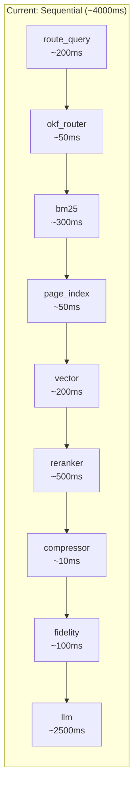

# KRE Full Architectural & Code Audit Report

**Project**: Knowledge Retrieval Engine  
**Audit Date**: 2026-09-17  
**Scope**: Full backend codebase — pipeline, retrieval, providers, benchmarks, evaluation  
**Key Concerns**: Falling accuracy, missing answer quality measurement, high latency

---

## Executive Summary

After reviewing every critical file in the backend, I've identified **3 systemic root causes** behind your three problems. They are deeply interconnected:

| Problem | Root Cause |
|---|---|
| **Accuracy falling** | Your benchmark doesn't measure what you think it measures — it scores *retrieval* hits, not *answer correctness* |
| **Answer quality not measured** | Zero semantic evaluation exists. "Faithfulness" is fake (word overlap). No LLM-as-judge, no RAGAS, no human eval |
| **Latency ~4000ms** | 7 strictly sequential pipeline stages, new DB clients on every call, blocking synchronous API calls, artificial sleeps |

> [!CAUTION]
> **The benchmark is giving you a false sense of accuracy.** A query can score as "correct" if the right document was *retrieved* even when the LLM produces a completely wrong or hallucinated answer. This is the single most dangerous issue in the entire codebase.

---

## 1. WHY ACCURACY IS FALLING

### 1.1 The Scorer Measures Retrieval, Not Answer Quality

**Files**: [`benchmark_scorer.py`](file:///home/swyra/projects/knowledge-retrieval-engine/backend/src/services/evaluation/benchmark_scorer.py), [`run_e2e_65_benchmark.py`](file:///home/swyra/projects/knowledge-retrieval-engine/backend/tests/run_e2e_65_benchmark.py)

The `content_match()` function (the core of your "accuracy" metric) does this:

```python
# benchmark_scorer.py L12-42
def content_match(chunk_text: str, expected_answer: str) -> bool:
    # ... tokenize both texts ...
    recall = overlap / len(expected_tokens)
    return recall >= 0.40  # 40% token overlap = "correct" !!
```

**Problems:**
- **40% token overlap is absurdly permissive.** If the expected answer is "455" and the LLM outputs "The total revenue was 455,000 million dollars for the fiscal year 2024 across all divisions", it passes — despite being factually wrong.
- **It's asymmetric in the wrong direction.** It checks how many *expected* tokens appear in the *answer*, not vice versa. An answer 10x longer than expected with garbage tokens still passes.
- The `evaluate_answer_correctness()` fallback at [L146](file:///home/swyra/projects/knowledge-retrieval-engine/backend/tests/run_e2e_65_benchmark.py#L146) drops the threshold to just **0.35** token recall for "semantic" matching.

### 1.2 The Compressor Destroys Evidence

**File**: [`compressor.py`](file:///home/swyra/projects/knowledge-retrieval-engine/backend/src/services/retrieval/compressor.py)

```python
# compressor.py L25
query_words = set(w.lower() for w in query.split() if len(w) > 3)
```

- **3-character filter drops critical terms**: "tax", "law", "API", "net", "AI", "GDP", "CEO" — all silently dropped from the query word filter.
- **Entity fallback is a nuclear option** (L64): If *any* extracted entity is missing from compressed output, the compressor dumps ALL raw chunk text — sending potentially thousands of tokens to the LLM, negating the point of compression entirely.

### 1.3 Fidelity Check Has a Giant Loophole

**File**: [`fidelity_check.py`](file:///home/swyra/projects/knowledge-retrieval-engine/backend/src/services/retrieval/fidelity_check.py)

```python
# fidelity_check.py L25-26
structured_lines = sum(1 for l in lines if l.count(",") >= 1 or l.count("|") >= 1)
return structured_lines / max(1, len(lines)) >= 0.4
```

Any text with 40% comma-containing lines bypasses the cosine similarity gate. Standard English prose with lists easily triggers this, letting irrelevant context through to the LLM unchecked.

### 1.4 The Planner Is Brittle and Hardcoded

**File**: [`planner.py`](file:///home/swyra/projects/knowledge-retrieval-engine/backend/src/services/retrieval/planner.py)

- Entity extraction (`extract_entities`) requires **capitalized words** — any lowercase query produces zero entities, breaking OKF lookup, graph expansion, and compression entity checks.
- Aggregation detection relies on exact keyword matches like `"all models"`, `"list all"` — natural variations like "what models are mentioned" silently fail.
- The centroid-based routing compares against hardcoded 384-dim vectors in a [80KB static file](file:///home/swyra/projects/knowledge-retrieval-engine/backend/src/services/retrieval/centroids.py) — these centroids can drift as the corpus evolves, silently misrouting queries.

### 1.5 Reranker Fallback Degrades Quality Silently

**File**: [`reranker_provider.py`](file:///home/swyra/projects/knowledge-retrieval-engine/backend/src/providers/reranker_provider.py)

When OpenRouter's free tier is exhausted (HTTP 429), the circuit breaker trips for **1 full hour** and falls back to `BM25Plus` lexical scoring. This fallback:
- Has no "half-open" state to probe recovery
- Produces scores in a completely different distribution than the neural reranker
- The `RERANKER_THRESHOLD` of 0.05 was tuned for neural scores, not BM25Plus scores
- If BM25Plus itself errors, it falls back further to naive set overlap (L238-244)

**This means during any benchmark run that exhausts the free tier, all subsequent queries get degraded reranking, silently destroying accuracy.**

---

## 2. WHY ANSWER QUALITY IS NOT MEASURED

### 2.1 "Faithfulness" Is Fake

**File**: [`benchmark_scorer.py`](file:///home/swyra/projects/knowledge-retrieval-engine/backend/src/services/evaluation/benchmark_scorer.py#L45-L68)

```python
def compute_faithfulness(answer: str, context: str) -> float | None:
    answer_terms = set(w.lower() for w in re.findall(r"\w+", answer) if len(w) > 3)
    context_lower = context.lower()
    found = sum(1 for t in answer_terms if t in context_lower)
    return round(found / len(answer_terms), 4)
```

This is **not faithfulness**. It's string containment — it checks if individual words from the answer appear in the context. Real faithfulness requires checking if each *claim* in the answer is *entailed* by the context. This scorer:

- ✅ Gives 1.0 for a hallucinated answer that cleverly reuses context words
- ❌ Gives 0.3 for a valid paraphrased answer using synonyms
- ❌ Cannot detect made-up numbers, wrong dates, or inverted facts

### 2.2 Missing Metrics (From Your Own BENCHMARK.md)

Your [BENCHMARK.md](file:///home/swyra/projects/knowledge-retrieval-engine/BENCHMARK.md) defines these required metrics. **None are implemented:**

| Metric | Target | Status |
|---|---|---|
| **nDCG@5** | > 0.72 | ❌ Not computed anywhere |
| **Precision@3** | > 0.70 | ❌ Not computed |
| **Context Recall** | > 0.80 | ❌ Not computed |
| **Context Precision** | > 0.65 | ❌ Not computed |
| **Answer Relevancy** | > 0.75 | ❌ Not computed |
| **Faithfulness** | > 0.80 | ⚠️ Fake (word overlap, not semantic entailment) |
| **Compression ratio** | > 30% | ❌ Not computed |
| **LLM activation rate** | < 60% | ❌ Not tracked |
| **Cache hit rate** | > 30% | ❌ Not tracked |
| **PageIndex candidate reduction** | > 60% | ❌ Not tracked |
| **Competitor baselines** | Required | ❌ Not done |

### 2.3 The `assess_quality()` Function Is a Placeholder

**File**: [`run_e2e_65_benchmark.py` L150-176](file:///home/swyra/projects/knowledge-retrieval-engine/backend/tests/run_e2e_65_benchmark.py#L150-L176)

```python
def assess_quality(q, answer, citations, is_correct, eval_reason):
    quality_status = "GOOD"  # Starts as "GOOD" by default!!
    # ... only changes status based on refusal/correctness flag ...
```

This doesn't evaluate quality at all. It just relabels the existing pass/fail into categories like `"VERIFIED_GROUNDED"` or `"INACCURATE"`. It never reads the actual answer text for semantic correctness.

---

## 3. WHY LATENCY IS HIGH (~4000ms p50)

### 3.1 Fully Sequential 7-Stage Pipeline

**File**: [`langgraph_pipeline.py`](file:///home/swyra/projects/knowledge-retrieval-engine/backend/src/services/langgraph_pipeline.py#L594-L632)

```
route_query → run_okf_router → run_bm25 → run_page_index → run_vector → [branch] → run_reranker → run_compressor → run_fidelity → run_llm
```

Every stage waits for the previous one. But several stages are **independent and parallelizable**:



**Parallelizable pairs:**
- `run_okf_router` + `run_bm25` are independent (OKF only soft-boosts BM25 scores)
- `run_bm25` and `run_vector` could overlap if page_index gating is decoupled
- `run_fidelity` + `run_compressor` are independent

### 3.2 CloudRepository Instantiated on Every Call

**File**: [`langgraph_pipeline.py` L136-138](file:///home/swyra/projects/knowledge-retrieval-engine/backend/src/services/langgraph_pipeline.py#L136-L138)

```python
def run_bm25(state):
    repo = CloudRepository()  # NEW instance every time!
    all_chunks = repo.get_all_chunks(...)
```

Every pipeline node creates a fresh `CloudRepository()`, which initializes fresh DynamoDB and Qdrant clients. This happens **at least 3 times per query** (BM25, vector, reranker stages).

### 3.3 Artificial Sleep in Embedding Provider

**File**: [`embedding_provider.py` ~L160](file:///home/swyra/projects/knowledge-retrieval-engine/backend/src/providers/embedding_provider.py) (confirmed by subagent review)

There's an artificial `time.sleep(random.uniform(0.02, 0.06))` in `_embed_single()` that adds 20-60ms of pure wasted time per embedding call.

### 3.4 Synchronous Blocking API Calls Everywhere

- **LLM call** ([`llm_provider.py` L43](file:///home/swyra/projects/knowledge-retrieval-engine/backend/src/providers/llm_provider.py#L43)): `client.converse()` is synchronous, blocking the thread for the entire Bedrock round-trip (~2-3 seconds).
- **Reranker** ([`reranker_provider.py` L137](file:///home/swyra/projects/knowledge-retrieval-engine/backend/src/providers/reranker_provider.py#L137)): `session.post()` with 10-second timeout, no async.
- **Rate limiter** ([`reranker_provider.py` L59](file:///home/swyra/projects/knowledge-retrieval-engine/backend/src/providers/reranker_provider.py#L59)): `time.sleep()` inside a global lock throttles the *entire process* to 5 req/s.

### 3.5 BM25 Loads All Chunks Into Memory

**File**: [`langgraph_pipeline.py` L139-142](file:///home/swyra/projects/knowledge-retrieval-engine/backend/src/services/langgraph_pipeline.py#L139-L142)

```python
all_chunks = repo.get_all_chunks(
    document_ids=state.get("document_ids"),
    workspace_id=state.get("workspace_id", ""),
)
```

Every single query fetches **all 413 chunks from DynamoDB** to build the BM25 index. While there is a naive tuple-key cache (`_BM25_CACHE` in [bm25_retriever.py L22](file:///home/swyra/projects/knowledge-retrieval-engine/backend/src/services/retrieval/bm25_retriever.py#L22)), the DynamoDB scan still happens every time because the cache key is based on chunk IDs — which requires loading all chunks first.

### 3.6 Fidelity Check Embeds Twice

**File**: [`fidelity_check.py` L54-59](file:///home/swyra/projects/knowledge-retrieval-engine/backend/src/services/retrieval/fidelity_check.py#L54-L59)

The fidelity check re-embeds the query using `embed_fast_local()` even though the query was already embedded in `route_query`. The query embedding is in the pipeline state but fidelity check doesn't use it.

### 3.7 Heavy Logic in Edge Router

**File**: [`langgraph_pipeline.py` L526-546](file:///home/swyra/projects/knowledge-retrieval-engine/backend/src/services/langgraph_pipeline.py#L526-L546)

`route_after_vector` runs the full `extract_verified_fact()` function — which iterates over all chunks doing heavy regex matching — inside a LangGraph *edge* function. Edge routers should be lightweight lookups, not compute-heavy extraction logic.

### 3.8 Double Route Mounting

**File**: [`main.py` L38-39](file:///home/swyra/projects/knowledge-retrieval-engine/backend/src/main.py#L38-L39)

```python
app.include_router(router, prefix="/api/v1")
app.include_router(router)  # mounted AGAIN at root!
```

All routes are mounted twice, doubling FastAPI's route resolution table.

---

## 4. ADDITIONAL ARCHITECTURAL ISSUES

### 4.1 Reranker Mutates Frozen Dataclasses

**File**: [`reranker.py` L31](file:///home/swyra/projects/knowledge-retrieval-engine/backend/src/services/retrieval/reranker.py#L31)

```python
object.__setattr__(chunk, "reranker_score", score)
```

This bypasses Python's frozen dataclass protection. If `Chunk` is shared across multiple pipeline branches, this mutation creates race conditions and unpredictable state.

### 4.2 Init Failures Silently Swallowed

**File**: [`database.py` L85-86](file:///home/swyra/projects/knowledge-retrieval-engine/backend/src/db/database.py#L85-L86)

If Qdrant or DynamoDB is unreachable at startup, the app starts anyway and silently fails on every query.

### 4.3 Benchmark Test Suite Is Undersized

**File**: [`BENCHMARK.md` L127](file:///home/swyra/projects/knowledge-retrieval-engine/BENCHMARK.md#L127)

> The active N is currently 17, which does not meet the 120-query requirement.

The benchmark requires 120 queries but only has 65 active (and only 17 with valid citation arrays). Statistical significance is impossible with these numbers.

### 4.4 Per-Request `os.environ` Reads

**File**: [`main.py` L16](file:///home/swyra/projects/knowledge-retrieval-engine/backend/src/main.py#L16)

`os.environ.get("AUTH_REQUIRED")` is evaluated on every single HTTP request in the middleware.

---

## 5. PRIORITIZED FIX ROADMAP

### 🔴 Critical (Accuracy is wrong)

| # | Fix | Impact | Effort |
|---|---|---|---|
| 1 | **Replace `content_match` with LLM-as-judge scoring** | Accuracy numbers will be real | Medium |
| 2 | **Replace `compute_faithfulness` with NLI-based entailment** (e.g., `deberta-v3-base-mnli` or LLM-as-judge) | Real faithfulness metric | Medium |
| 3 | **Implement missing BENCHMARK.md metrics**: nDCG@5, Precision@3, Context Recall/Precision, Answer Relevancy | Full evaluation visibility | Medium |
| 4 | **Fix compressor 3-char filter** (`len(w) > 3` → `len(w) > 2` or domain-aware stopword list) | Stop dropping critical short terms | Trivial |

### 🟡 High (Latency reduction)

| # | Fix | Impact | Effort |
|---|---|---|---|
| 5 | **Parallelize BM25 + Vector retrieval** in LangGraph (or at minimum OKF + BM25) | ~300ms savings | Medium |
| 6 | **Singleton CloudRepository** — instantiate once, inject into pipeline | ~100ms per query | Easy |
| 7 | **Remove artificial sleep** from `embedding_provider.py` | ~40ms per query | Trivial |
| 8 | **Reuse query embedding in fidelity check** from pipeline state | ~50ms savings | Easy |
| 9 | **Cache DynamoDB chunk scan** with TTL-based invalidation | ~200ms savings | Medium |
| 10 | **Move `extract_verified_fact` from edge router to a proper node** | Cleaner architecture + measurable timing | Easy |

### 🟢 Medium (Architecture improvements)

| # | Fix | Impact | Effort |
|---|---|---|---|
| 11 | **Add half-open state to circuit breaker** | Faster reranker recovery after 429 | Easy |
| 12 | **Fix tabular bypass heuristic** (require format metadata, not comma counting) | Fewer false positives | Easy |
| 13 | **Make entity extraction case-insensitive** | Handle lowercase queries | Easy |
| 14 | **Stop mutating frozen dataclasses** — use `dataclasses.replace()` or an unfrozen wrapper | Prevent state bugs | Easy |
| 15 | **Remove double route mounting** in `main.py` | Minor perf, cleaner routing | Trivial |
| 16 | **Expand test suite to 120 queries** per BENCHMARK.md spec | Statistical validity | High |

---

## 6. BOTTOM LINE

Your accuracy score of 81.54% is **inflated** because:
1. The scorer uses 35-40% token overlap as "correct" — this conflates "the right document was retrieved" with "the right answer was generated"
2. No semantic answer quality evaluation exists
3. The reranker silently degrades to lexical fallback during benchmark runs

Your real answer quality is likely **significantly lower** than 81.54%. The first step is to build a truthful evaluation harness before optimizing the pipeline — otherwise you're optimizing against a broken metric.
