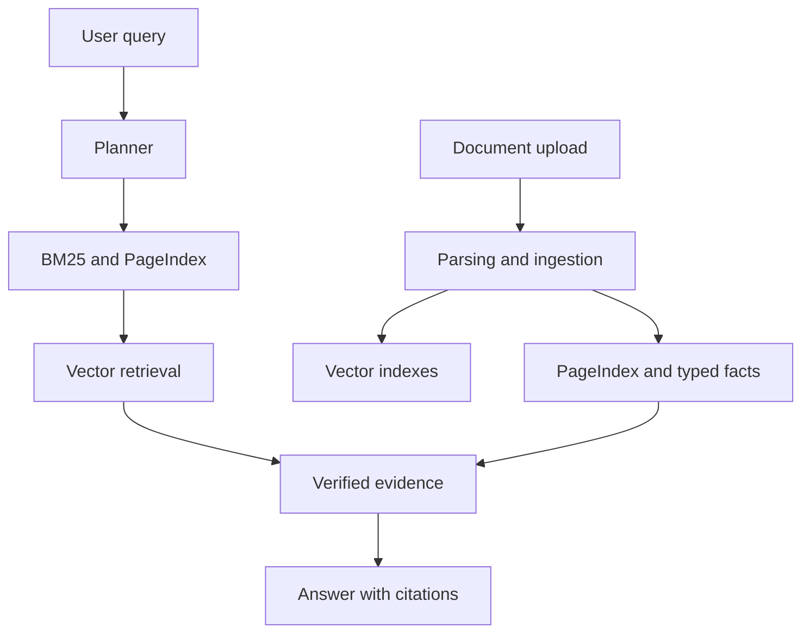

# Knowledge Retrieval Engine (KRE)

> A verifiable enterprise document-intelligence platform that answers questions with page- and paragraph-level citations.

KRE is built for teams that need more than a plausible chatbot answer. It ingests PDFs, DOCX, CSV, PPTX, and XLSX files, retrieves evidence through a staged hybrid pipeline, and returns a grounded response with the exact source location.

## Why KRE

Traditional RAG can lose document structure by splitting text into blind chunks. KRE preserves structural context before semantic retrieval and separates deterministic fact lookup from LLM-generated explanation.

- **Traceable answers:** citations include source file, page or sheet, paragraph, and bounding-box metadata when available.
- **Staged hybrid retrieval:** BM25 -> PageIndex -> vector search -> typed-fact lookup -> optional graph traversal.
- **Cost-aware routing:** fast-path queries use local BGE-small ONNX embeddings; complex queries can use Titan embeddings and reranking.
- **Grounded generation:** the LLM receives compressed, relevant evidence only; the system targets one synthesis call per query.
- **Enterprise-ready services:** FastAPI API, a React/TypeScript workspace, DynamoDB, Qdrant, Redis, and AWS deployment paths.

## Architecture

## Tech Stack

| Area | Technologies |
| --- | --- |
| Backend | Python, FastAPI, LangGraph, Pydantic, Boto3 |
| AI and retrieval | BGE-small ONNX, Amazon Titan Embeddings V2, Amazon Nova, NVIDIA reranking, BM25 |
| Data | DynamoDB, Qdrant, Redis |
| Frontend | React, TypeScript, Vite, Tailwind CSS |
| Cloud | AWS Lambda, API Gateway, S3, ECR |

## Repository Guide

- [Architecture](ARCHITECTURE.md) - deployment model, service boundaries, storage, and constraints.
- [API contract](API.md) - endpoint specifications and response shapes.
- [Project design](PROJECT.md) - retrieval design, model strategy, and tradeoffs.
- [Benchmarks](BENCHMARK.md) - evaluation plan and results.

## Project Status

KRE is under active development. The documented v1 focuses on document ingestion, traceable retrieval, and a citation-first question-answering workflow. See [PROJECT.md](PROJECT.md) and [PHASES.md](PHASES.md) for the current scope and roadmap.

## Local Development

See the project's configuration and architecture documentation before running locally. Copy `.env.example` to `.env` and provide the required service credentials for the selected development mode.

## License

No license has been declared for this repository.
