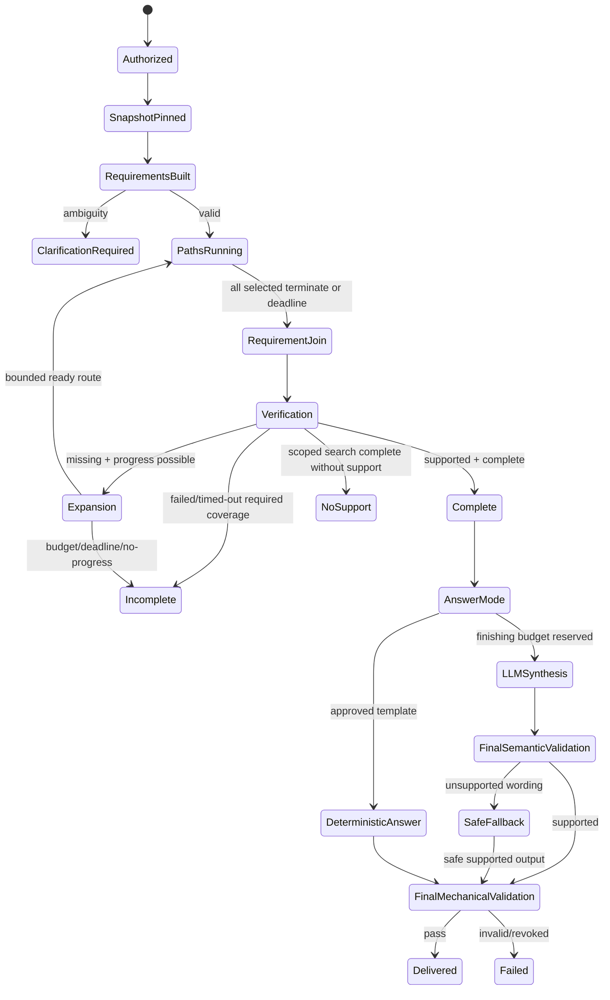

# KRE Workflow

## Master Workflow
```text
Upload → Authorize/Register → Validate → Immutable Source
→ Extract → Canonical Evidence
→ Baseline QA → Baseline Stores → Minimal Map → Baseline Snapshot
→ Optional Enrichment → Enriched Snapshot
→ Query → Authorize/Pin Snapshot → Requirements
→ Route → Execute/Discover → Join
→ Exact Evidence Fetch → Mechanical + Semantic Verification
→ Support + Completeness
→ Deterministic Answer OR Bounded Synthesis
→ Final Validation
```

## Query State Machine

