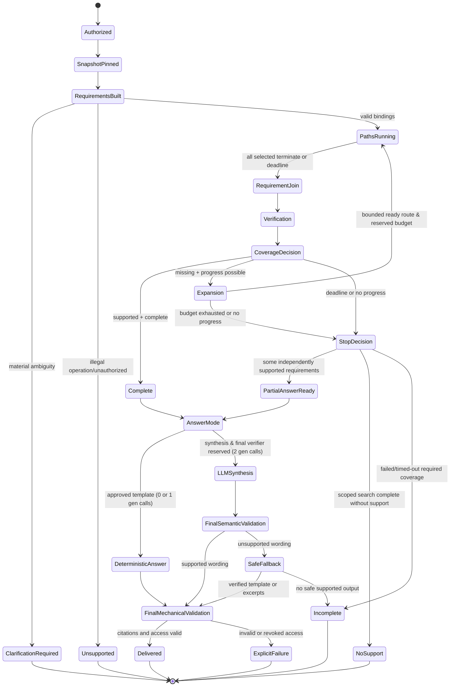

# KRE Workflow

## Master Workflow
```text
Upload → Authorize/Register → Validate → Immutable Source
→ Extract → Canonical Evidence
  ├─→ Baseline QA → Baseline Stores → Minimal Map → Baseline Snapshot (Immediately Queryable)
  └─→ [Asynchronous Branch] Optional Enrichment (PageIndex/OKF/Graph) 
        → Validate Support & Compatibility → Generation-Checked Publication → Extended Snapshot

Query Workflow:
Query → Authorize/Pin Snapshot → Requirements Built
→ Per-Requirement Route → Dispatch Structured Execution / Discovery Branches
→ Fan-In Barrier (Branch Join + Status/Deadline) → Compatible RRF / Rerank
→ Requirement Join (Mandatory Execution + Discovery Evidence)
→ Exact Evidence Fetch → Mechanical + Semantic Support Verification
→ Coverage & Completeness Decision
→ (Complete OR PartialAnswerReady) → AnswerMode (Deterministic Template OR Bounded Synthesis)
→ Final Semantic Validation → Final Mechanical/Access Validation → Delivered Result
```

## Answer-Mode-Aware Model Reservations

Query execution dynamically reserves model generation capacity based on the required answer mode under the `query-default-v3` budget ledger (`MAX_QUERY_LLM_CALLS = 2`):

- **0 Generation Calls (Exact Deterministic Path):**
  - Bound exact lookup or AST calculation + approved deterministic template.
  - Generative synthesis and generative verification are **not** reserved unconditionally.
  - Zero generation calls consumed; mechanically verified citations.
- **1 Generation Call (Planning + Deterministic Execution):**
  - Validated planning proposal (1 LLM generation call) + code-executed AST calculation + approved deterministic template.
  - Code validates all operands and filters; output uses deterministic formatting with zero synthesis calls.
- **2 Generation Calls (Narrative Synthesis Path):**
  - Bounded narrative synthesis (1 LLM call) + final semantic verification (1 LLM call).
  - The scheduler reserves both slots **before** dispatching optional exploratory work.
  - Delivers only verified, supported wording.
- **3 Generation Calls (Disallowed Path):**
  - Planning (1) + synthesis (1) + generative verifier (1) totals 3 generation calls and is **strictly disallowed** under the default policy.
  - Workflows requiring generative planning must format the result through an approved deterministic template, or escalate under an administrative high-budget policy.
- **Answer Mode Transitions & Delivery Gate:**
  - If answer mode changes during execution (e.g. escalating from deterministic template to narrative synthesis), the scheduler must reserve finishing capacity (1 synthesis + 1 generative verifier) **BEFORE** any optional work.
  - If remaining budget cannot satisfy both finishing calls, free-form generation is prohibited (falling back to verified templates or excerpts).
  - **Never deliver generated wording without its required semantic and mechanical validation.**

## Query State Machine

