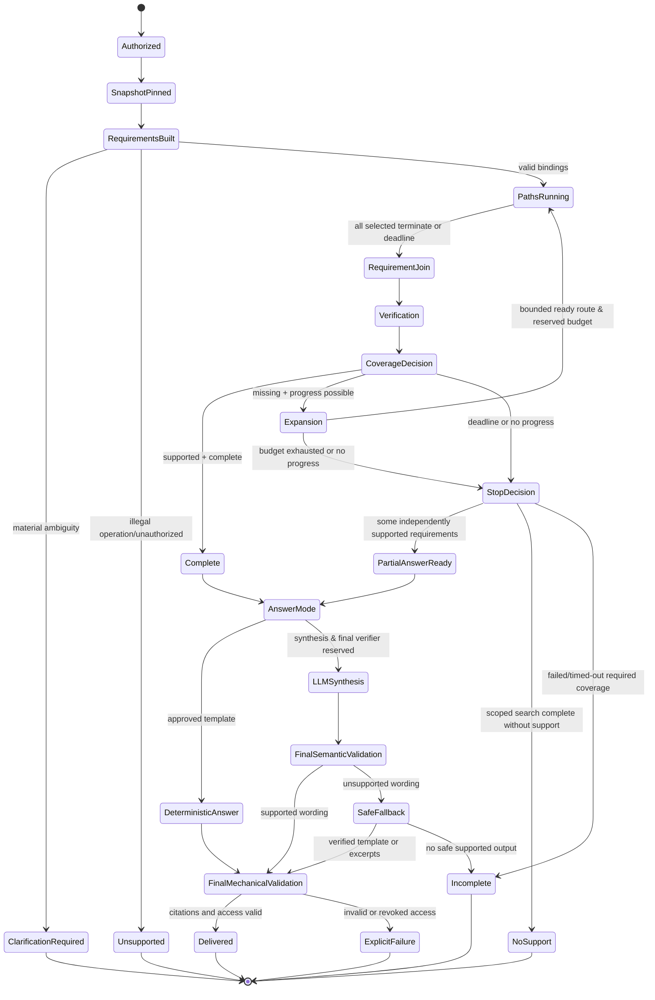

# KRE Workflow

# KRE Workflow

## Master Workflow
```text
Upload → Authorize/Register → Validate → Immutable Source
→ Extract → Canonical Evidence
  ├─→ Baseline QA → Baseline Stores → Minimal Map → Baseline Snapshot (Immediately Queryable)
  └─→ [Asynchronous Branch] Optional Enrichment (PageIndex/OKF/Graph) 
        → Validate Support & Compatibility → Generation-Checked Publication → Extended Snapshot

Query Workflow:
Query → Authorize/Pin Snapshot → Requirements Built
→ Per-Requirement Route → Dispatch Structured Execution / Discovery Branches
→ Fan-In Barrier (Branch Join + Status/Deadline) → Compatible RRF / Rerank
→ Requirement Join (Mandatory Execution + Discovery Evidence)
→ Exact Evidence Fetch → Mechanical + Semantic Support Verification
→ Coverage & Completeness Decision
→ (Complete OR PartialAnswerReady) → AnswerMode (Deterministic Template OR Bounded Synthesis)
→ Final Semantic Validation → Final Mechanical/Access Validation → Delivered Result
```

## Query State Machine


