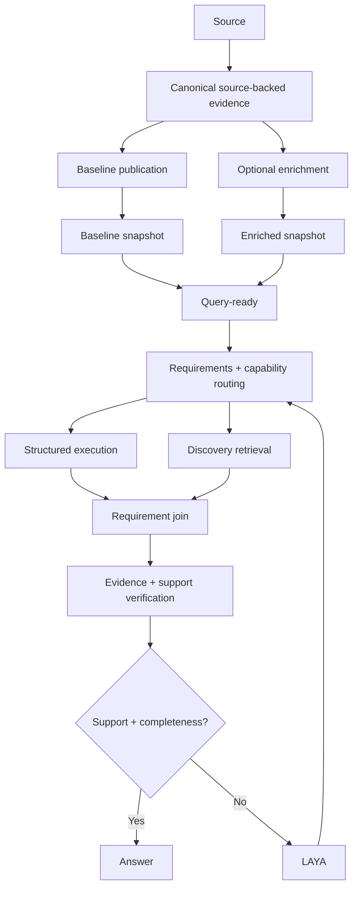

# 01 — System Overview

```mermaid
flowchart TB
    SRC["Source"] --> CAN["Canonical source-backed evidence"]
    CAN --> BASE["Baseline publication"]
    CAN --> ENR["Optional enrichment"]
    BASE --> BSNAP["Baseline snapshot"]
    ENR --> ESNAP["Enriched snapshot"]
    BSNAP --> Q["Query-ready"]
    ESNAP --> Q
    Q --> PLAN["Requirements + capability routing"]
    PLAN --> S["Structured execution"]
    PLAN --> R["Discovery retrieval"]
    S --> J["Requirement join"]
    R --> J
    J --> V["Evidence + support verification"]
    V --> A{"Support + completeness?"}
    A -->|Yes| ANS["Answer"]
    A -->|No| L["LAYA"]
    L --> PLAN
```
