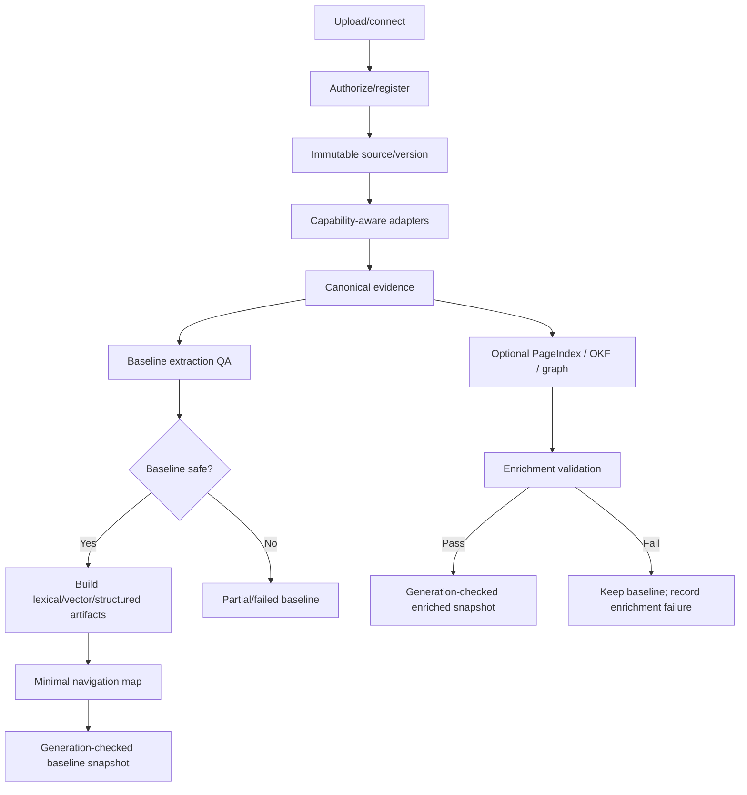

# 02 — Ingestion and Publication

```mermaid
flowchart TB
    U["Upload/connect"] --> AUTH["Authorize/register"]
    AUTH --> RAW["Immutable source/version"]
    RAW --> EXT["Capability-aware adapters"]
    EXT --> CAN["Canonical evidence"]
    CAN --> QA["Baseline extraction QA"]
    QA --> BASE{"Baseline safe?"}
    BASE -->|Yes| STORES["Build lexical/vector/structured artifacts"]
    BASE -->|No| FAIL["Partial/failed baseline"]

    STORES --> MAP["Minimal navigation map"]
    MAP --> SNAP["Generation-checked baseline snapshot"]

    CAN --> ENR["Optional PageIndex / OKF / graph"]
    ENR --> EQA["Enrichment validation"]
    EQA -->|Pass| ES["Generation-checked enriched snapshot"]
    EQA -->|Fail| KEEP["Keep baseline; record enrichment failure"]
```
