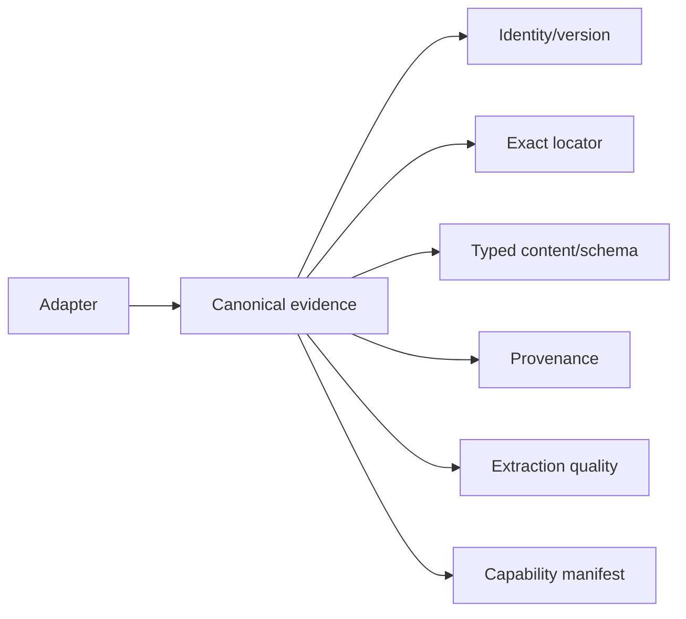

# 03 — Canonical Evidence

```mermaid
flowchart LR
    AD["Adapter"] --> CE["Canonical evidence"]
    CE --> ID["Identity/version"]
    CE --> LOC["Exact locator"]
    CE --> DATA["Typed content/schema"]
    CE --> PROV["Provenance"]
    CE --> QUAL["Extraction quality"]
    CE --> CAP["Capability manifest"]
```
