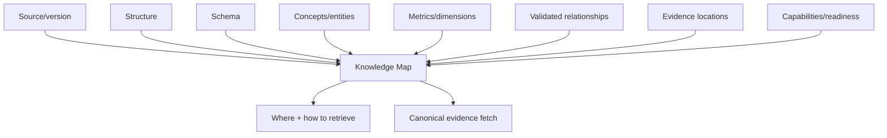

# 04 — Knowledge Map

```mermaid
flowchart TB
    ID["Source/version"]
    STR["Structure"]
    SCH["Schema"]
    ENT["Concepts/entities"]
    MET["Metrics/dimensions"]
    REL["Validated relationships"]
    LOC["Evidence locations"]
    CAP["Capabilities/readiness"]

    ID --> KM["Knowledge Map"]
    STR --> KM
    SCH --> KM
    ENT --> KM
    MET --> KM
    REL --> KM
    LOC --> KM
    CAP --> KM

    KM --> ROUTE["Where + how to retrieve"]
    KM --> SRC["Canonical evidence fetch"]
```
