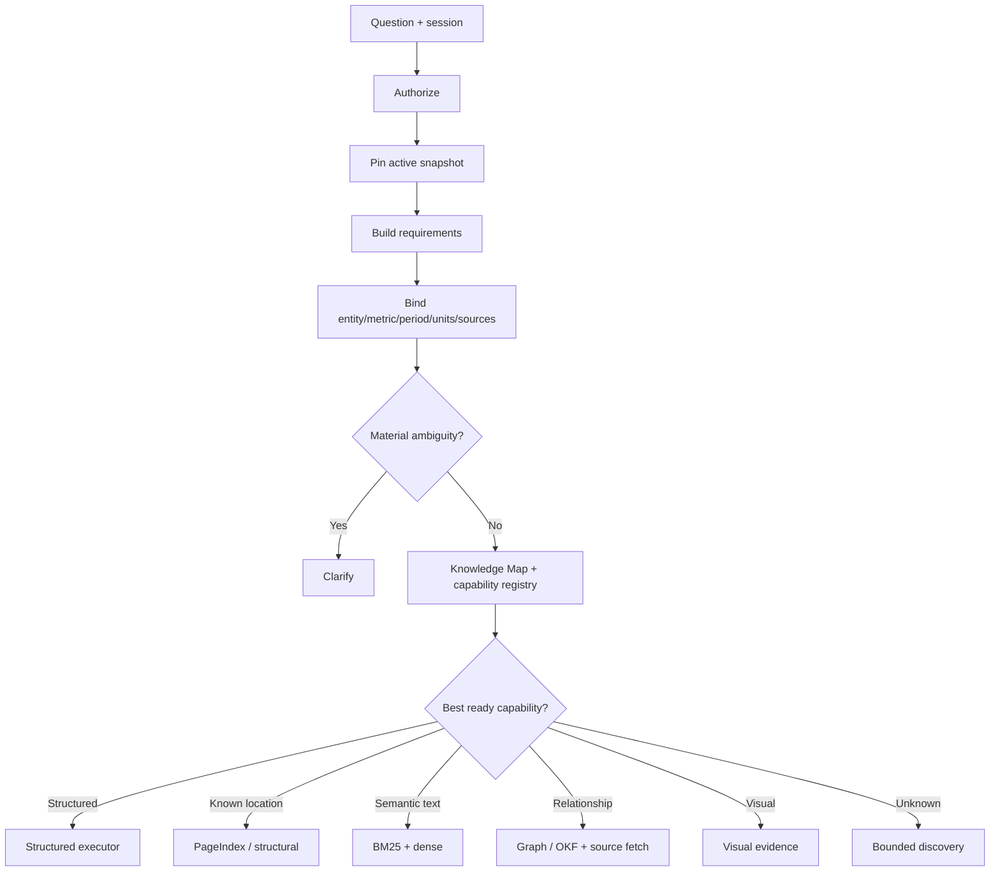

# 05 — Query Requirement Routing

```mermaid
flowchart TD
    Q["Question + session"] --> AUTH["Authorize"]
    AUTH --> SNAP["Pin active snapshot"]
    SNAP --> REQ["Build requirements"]
    REQ --> BIND["Bind entity/metric/period/units/sources"]
    BIND --> AMB{"Material ambiguity?"}
    AMB -->|Yes| CLAR["Clarify"]
    AMB -->|No| MAP["Knowledge Map + capability registry"]

    MAP --> TYPE{"Best ready capability?"}
    TYPE -->|Structured| S["Structured executor"]
    TYPE -->|Known location| P["PageIndex / structural"]
    TYPE -->|Semantic text| T["BM25 + dense"]
    TYPE -->|Relationship| G["Graph / OKF + source fetch"]
    TYPE -->|Visual| V["Visual evidence"]
    TYPE -->|Unknown| D["Bounded discovery"]
```
