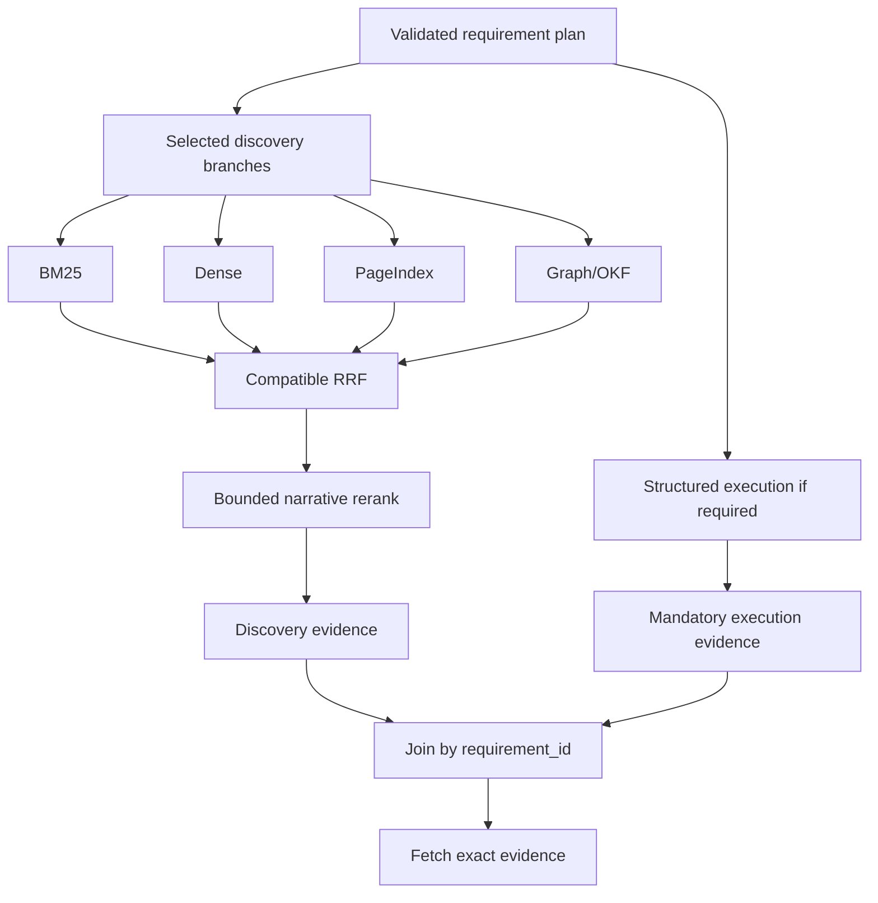

# 06 — Retrieval and Execution Join

```mermaid
flowchart TB
    PLAN["Validated requirement plan"] --> DISC["Selected discovery branches"]
    PLAN --> EXE["Structured execution if required"]

    DISC --> BM["BM25"]
    DISC --> DV["Dense"]
    DISC --> PI["PageIndex"]
    DISC --> GR["Graph/OKF"]

    BM --> RRF["Compatible RRF"]
    DV --> RRF
    PI --> RRF
    GR --> RRF

    RRF --> RR["Bounded narrative rerank"]
    RR --> DC["Discovery evidence"]

    EXE --> ME["Mandatory execution evidence"]

    DC --> JOIN["Join by requirement_id"]
    ME --> JOIN
    JOIN --> FETCH["Fetch exact evidence"]
```
