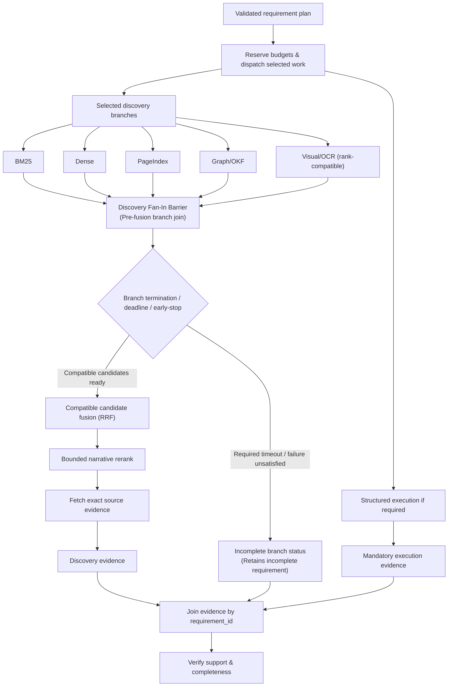

# 06 — Retrieval and Execution Join

## Discovery Fan-In Barrier Contract

### Branch Status & Coverage Payload
Each active discovery branch reports:
- `branch_status`: `COMPLETE` | `FAILED` | `TIMED_OUT` | `CANCELLED` | `UNAVAILABLE`
- `coverage`: Scoped range / records examined (e.g. `chunks_1_620`, section IDs)
- `artifact_version`: Version identity of the index/artifact queried
- `candidates`: List of typed `DiscoveryCandidate` records

### Deadline Handling
- The discovery coordinator allocates a bounded timeout per branch derived from the global query deadline.
- When the deadline expires, active branches receive cancellation, their status is set to `TIMED_OUT`, and available candidates are gathered.

### Justified Early-Stop Rules
- Fusion **cannot begin** merely because the fastest branch returned.
- Early stop is justified **only** when every requirement assigned to the discovery plane is already supported with high confidence and mandatory exhaustive/conflict checks are satisfied.
- Top-k retrieval scores never justify skipping required branch completion on negative, exhaustive, or summary questions.

### Timeout and Incompleteness Invariant
- A timed-out required branch **must remain incomplete** unless an independent parallel branch has fully satisfied the exact same requirement.
- Retrieval scores or partial candidates do not close a requirement; unfulfilled required branches bubble up to `RETRIEVAL_INCOMPLETE`.

