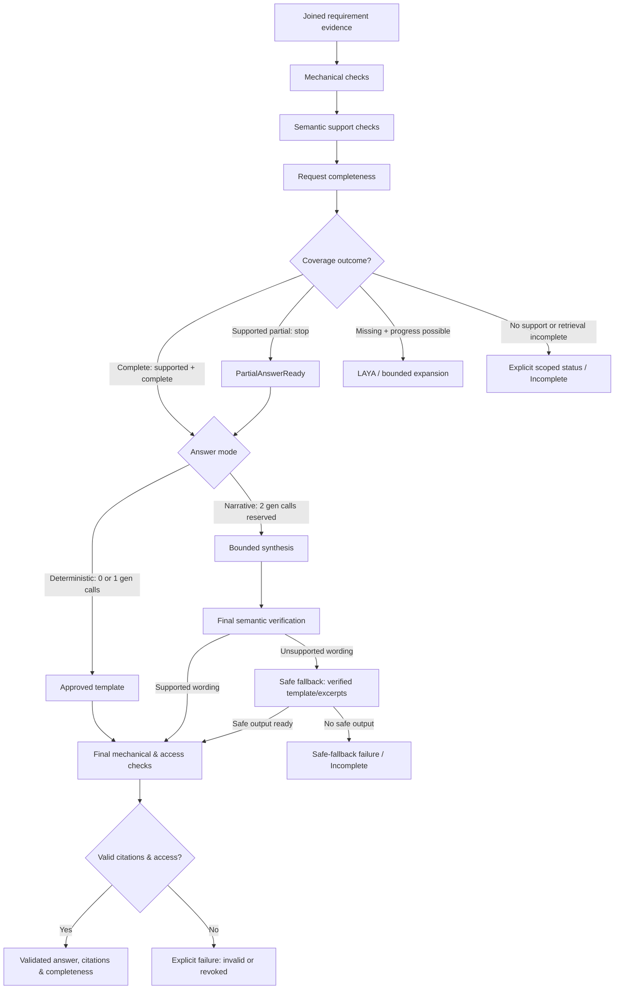

# 07 — Verification and Answer

```mermaid
flowchart TD
    JOIN["Joined requirement evidence"] --> M["Mechanical checks"]
    M --> S["Semantic support checks"]
    S --> C["Request completeness"]
    C --> CO{"Coverage outcome?"}
    CO -->|Complete: supported + complete| MODE{"Answer mode"}
    CO -->|Supported partial: stop| PART["PartialAnswerReady"]
    CO -->|Missing + progress possible| EXP["LAYA / bounded expansion"]
    CO -->|No support or retrieval incomplete| OUT["Explicit scoped status / Incomplete"]
    PART --> MODE
    MODE -->|Deterministic: 0 or 1 gen calls| DET["Approved template"]
    MODE -->|Narrative: 2 gen calls reserved| LLM["Bounded synthesis"]
    LLM --> SV["Final semantic verification"]
    SV -->|Supported wording| FM["Final mechanical & access checks"]
    SV -->|Unsupported wording| SF["Safe fallback: verified template/excerpts"]
    SF -->|Safe output ready| FM
    SF -->|No safe output| SFF["Safe-fallback failure / Incomplete"]
    DET --> FM
    FM --> OK{"Valid citations & access?"}
    OK -->|Yes| ANS["Validated answer, citations & completeness"]
    OK -->|No| REV["Explicit failure: invalid or revoked"]
```
