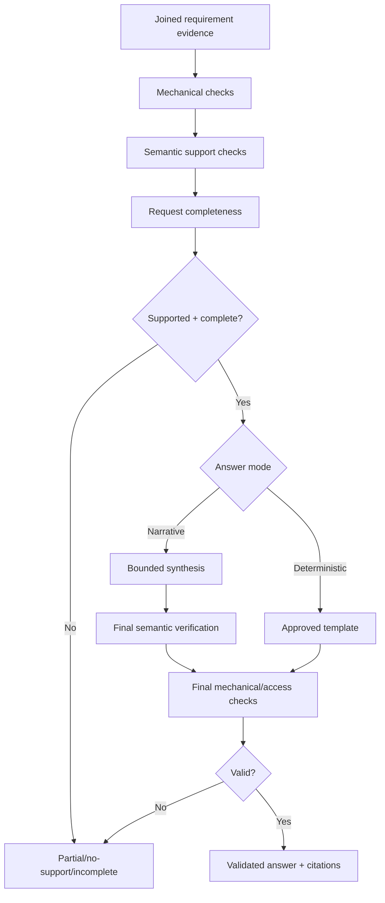

# 07 — Verification and Answer

```mermaid
flowchart TD
    JOIN["Joined requirement evidence"] --> M["Mechanical checks"]
    M --> S["Semantic support checks"]
    S --> C["Request completeness"]
    C --> D{"Supported + complete?"}
    D -->|No| OUT["Partial/no-support/incomplete"]
    D -->|Yes| MODE{"Answer mode"}
    MODE -->|Deterministic| DET["Approved template"]
    MODE -->|Narrative| LLM["Bounded synthesis"]
    LLM --> SV["Final semantic verification"]
    SV --> FM["Final mechanical/access checks"]
    DET --> FM
    FM --> OK{"Valid?"}
    OK -->|Yes| ANS["Validated answer + citations"]
    OK -->|No| OUT
```
