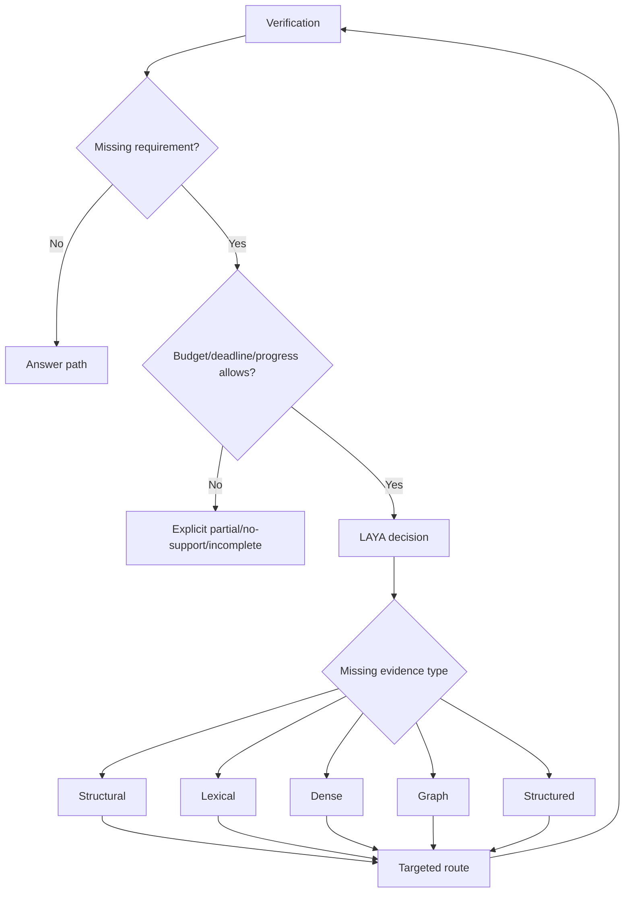

# 08 — LAYA

```mermaid
flowchart TD
    V["Verification"] --> MISS{"Missing requirement?"}
    MISS -->|No| DONE["Answer path"]
    MISS -->|Yes| BUD{"Budget/deadline/progress allows?"}
    BUD -->|No| FAIL["Explicit partial/no-support/incomplete"]
    BUD -->|Yes| L["LAYA decision"]
    L --> TYPE{"Missing evidence type"}
    TYPE --> P["Structural"]
    TYPE --> LEX["Lexical"]
    TYPE --> D["Dense"]
    TYPE --> G["Graph"]
    TYPE --> S["Structured"]
    P --> R["Targeted route"]
    LEX --> R
    D --> R
    G --> R
    S --> R
    R --> V
```
