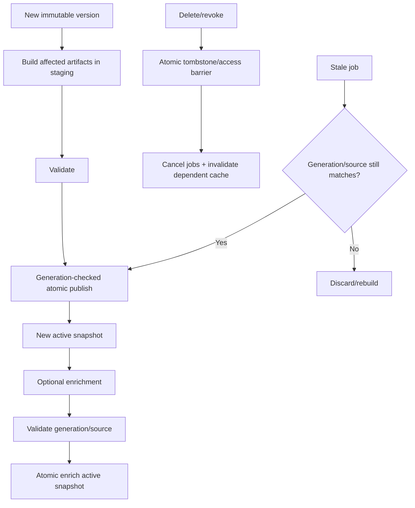

# 09 — Lifecycle and Publication

```mermaid
flowchart TB
    NEW["New immutable version"] --> BUILD["Build affected artifacts in staging"]
    BUILD --> QA["Validate"]
    QA --> PUB["Generation-checked atomic publish"]
    PUB --> ACTIVE["New active snapshot"]
    ACTIVE --> ENR["Optional enrichment"]
    ENR --> EQA["Validate generation/source"]
    EQA --> EPUB["Atomic enrich active snapshot"]

    DEL["Delete/revoke"] --> TOM["Atomic tombstone/access barrier"]
    TOM --> INV["Cancel jobs + invalidate dependent cache"]

    STALE["Stale job"] --> CHECK{"Generation/source still matches?"}
    CHECK -->|No| DISC["Discard/rebuild"]
    CHECK -->|Yes| PUB
```
