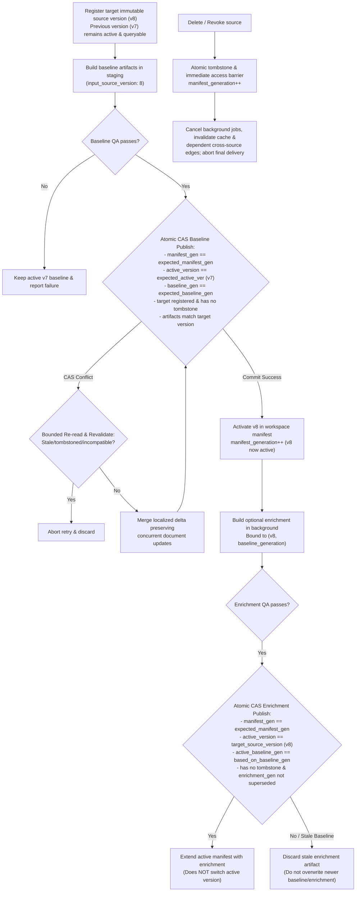

# 09 — Lifecycle and Publication

```mermaid
flowchart TB
    REG["Register target immutable source version (v8)\nPrevious version (v7) remains active & queryable"] --> STAGE["Build baseline artifacts in staging\n(input_source_version: 8)"]
    STAGE --> BQA{"Baseline QA passes?"}
    BQA -->|No| FAIL["Keep active v7 baseline & report failure"]
    BQA -->|Yes| CAS_BASE{"Atomic CAS Baseline Publish:\n- manifest_gen == expected_manifest_gen\n- active_version == expected_active_ver (v7)\n- baseline_gen == expected_baseline_gen\n- target registered & has no tombstone\n- artifacts match target version"}
    CAS_BASE -->|CAS Conflict| RETRY{"Bounded Re-read & Revalidate:\nStale/tombstoned/incompatible?"}
    RETRY -->|Yes| ABORT["Abort retry & discard"]
    RETRY -->|No| MERGE_DELTA["Merge localized delta preserving\nconcurrent document updates"]
    MERGE_DELTA --> CAS_BASE
    CAS_BASE -->|Commit Success| ACTIVATE["Activate v8 in workspace manifest\nmanifest_generation++ (v8 now active)"]

    ACTIVATE --> ENR_BUILD["Build optional enrichment in background\nBound to (v8, baseline_generation)"]
    ENR_BUILD --> EQA{"Enrichment QA passes?"}
    EQA -->|Yes| CAS_ENR{"Atomic CAS Enrichment Publish:\n- manifest_gen == expected_manifest_gen\n- active_version == target_source_version (v8)\n- active_baseline_gen == based_on_baseline_gen\n- has no tombstone & enrichment_gen not superseded"}
    CAS_ENR -->|Yes| ENR_EXTEND["Extend active manifest with enrichment\n(Does NOT switch active version)"]
    CAS_ENR -->|No / Stale Baseline| ENR_DISC["Discard stale enrichment artifact\n(Do not overwrite newer baseline/enrichment)"]

    DEL["Delete / Revoke source"] --> TOMB["Atomic tombstone & immediate access barrier\nmanifest_generation++"]
    TOMB --> CLEANUP["Cancel background jobs, invalidate cache &\ndependent cross-source edges; abort final delivery"]
```
