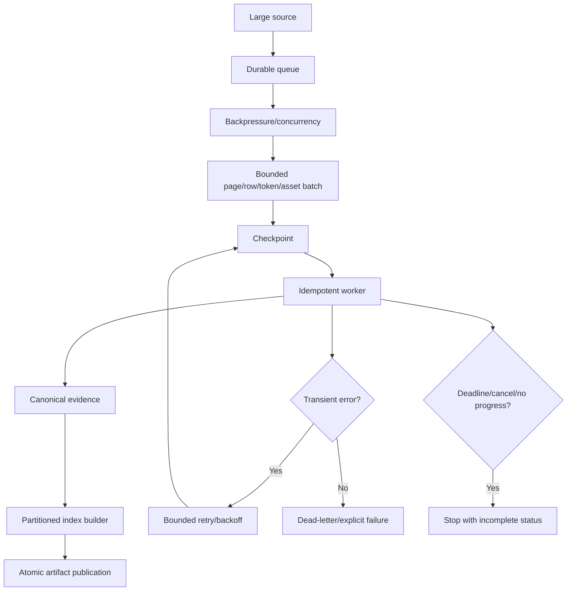

# 10 — Large Corpus Operations

```mermaid
flowchart TB
    SRC["Large source"] --> Q["Durable queue"]
    Q --> BP["Backpressure/concurrency"]
    BP --> B["Bounded page/row/token/asset batch"]
    B --> CK["Checkpoint"]
    CK --> W["Idempotent worker"]
    W --> CE["Canonical evidence"]
    CE --> IDX["Partitioned index builder"]
    IDX --> PUB["Atomic artifact publication"]

    W --> E{"Transient error?"}
    E -->|Yes| RETRY["Bounded retry/backoff"]
    RETRY --> CK
    E -->|No| DLQ["Dead-letter/explicit failure"]

    W --> DEAD{"Deadline/cancel/no progress?"}
    DEAD -->|Yes| STOP["Stop with incomplete status"]
```
